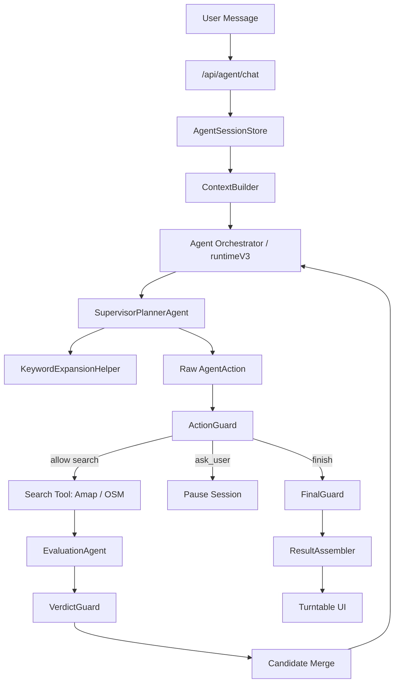

# ChiSha 今天吃啥

> 一个基于 Agent 的餐厅推荐应用。用户用自然语言描述需求，系统理解目标、搜索附近餐厅、验证候选，再用转盘帮助做最终选择。

[](https://www.typescriptlang.org/)
[](https://nextjs.org/)
[](https://react.dev/)

## 给新开发者的第一句话

这个项目不是“把用户输入丢给 LLM，然后让 LLM 返回餐厅”。

正确理解是：

1. LLM 负责理解用户目标、提出下一步 action、做候选语义验证。
2. Runtime 负责执行 loop、调用工具、控制预算、保存状态。
3. Guard 和 FinalGuard 负责安全边界和主推荐准入。
4. 搜索工具只返回餐厅事实，不判断用户到底该吃什么。
5. 前端只展示 Agent 状态、问题、候选和转盘结果，不推断 Agent 内部逻辑。

如果你刚开始做 Agent 开发，请先记住一个原则：模型可以建议，系统必须验证。

## 快速开始

### 前置要求

- Node.js 18 或更高版本
- npm
- OpenAI 兼容 API Key
- 高德地图 Web 服务 API Key
- 可选：Cloudflare D1，用于生产环境持久化 Agent session

### 安装与启动

```bash
npm install
cp .env.example .env.local
npm run dev
```

访问 http://localhost:3000。

### 最小环境变量

```env
OPENAI_API_KEY=sk-...
OPENAI_BASE_URL=https://api.openai.com/v1
OPENAI_MODEL=gpt-5.2
# 兼容旧 OpenAI-compatible 端点时可选
# OPENAI_TOOL_CALL_MODE=functions

AMAP_API_KEY=...
NEXT_PUBLIC_AMAP_KEY=...
AMAP_SECURITY_CODE=...

NEXT_PUBLIC_APP_URL=http://localhost:3000
LOG_LEVEL=info
```

完整变量见 [环境变量](#环境变量)。

## 常用命令

```bash
# 开发
npm run dev

# 类型检查
npm run type-check

# ESLint
npm run lint

# 测试
npm test
npm run test:watch
npm run test:coverage

# Next.js 构建
npm run build

# Cloudflare Workers 构建与部署
npm run build:cloudflare
npm run deploy

# Cloudflare D1 迁移
npm run db:migrate:local
npm run db:migrate:remote
```

## 技术栈

- Next.js 16 App Router
- React 18
- TypeScript 5.6
- Tailwind CSS 3.4
- Zod
- OpenAI 兼容模型接口
- 高德地图 Web 服务 API
- OpenStreetMap fallback
- Jest + React Testing Library
- Cloudflare Workers / D1

## Agent 架构总览

当前主链路是 Runtime V3，并已按方案 A 收敛到单一主控概念：`SupervisorPlannerAgent`。它通过 `lib/agent/supervisorPlanner.ts` 提供 canonical 入口，统一维护 `UserGoal`、处理追问、生成 `GoalPatch`，并选择下一步 `AgentAction`。Runtime 只负责编排、执行工具、权限、预算、guard 和审计。

当前实现仍可能在一轮推荐里分两次调用 planner：先维护 goal，再经过 `KeywordExpansionHelper` 补搜索词，随后让同一个 planner 选择 action。这样先消除第二 Supervisor 概念，再评估是否把 goal/action 合并为一次模型调用。



### 一次推荐发生了什么

1. 用户输入：“附近想吃便宜点的川菜，不要太远。”
2. `/api/agent/chat` 校验请求，加载或创建 session。
3. `SupervisorPlannerAgent` 理解用户消息，创建或更新 `UserGoal`。
4. `KeywordExpansionHelper` 为明确目标生成可搜索的同义词或相邻品类。
5. `SupervisorPlannerAgent` 基于 goal、attempts、observations 和 candidates 决定下一步：搜索、追问或结束。
6. `ActionGuard` 校验 action 是否安全、合法、在预算内。
7. 搜索工具调用高德，失败时 fallback 到 OSM。
8. `EvaluationAgent` 根据事实字段验证候选是否符合用户目标。
9. `VerdictGuard` 清理模型 verdict 中不合法的内容。
10. `FinalGuard` 决定哪些候选能进入主推荐。
11. 前端收到 SSE 事件，展示进度、追问、结果和转盘。

## 核心概念

### UserGoal

`UserGoal` 是“用户到底想要什么”的结构化表达。

它应该包含：

- 用户明确想吃的菜品或菜系
- 距离、预算、营业状态等硬约束
- 环境好、人气高、清淡点等软偏好
- 是否允许放宽
- 是否还需要追问

它不应该包含：

- 餐厅事实
- 搜索结果
- 编造出来的菜单、评分或距离
- 高德 POI typecode 的自由生成结果

相关文件：

- `lib/agent/types.ts`
- `lib/agent/schemas/goal.ts`
- `lib/agent/supervisorPlanner.ts`
- `lib/agent/supervisor.ts`（兼容旧 goal helper 的过渡入口）

### SearchPlan

`SearchPlan` 是“下一次该怎么搜索”的计划。

它应该包含：

- 单个或少量餐饮搜索词
- 搜索半径
- 搜索意图：`exact`、`synonym`、`broadened`、`fallback`
- 是否允许结果进入主推荐
- 搜索理由

注意：高德 POI 搜索中，`keywords` 不要把多个无关意图合成一个字符串，例如不要生成 `川菜|咖啡|奶茶`。多个意图应该拆成多次搜索。

相关文件：

- `lib/agent/schemas/plan.ts`
- `lib/agent/supervisorPlanner.ts`
- `lib/agent/supervisor.ts`（兼容旧 goal helper 的过渡入口）
- `lib/agent/runtimeV3.ts`
- `lib/agent/poiTaxonomy.ts`

### CandidateVerdict

`CandidateVerdict` 是 `EvaluationAgent` 对餐厅候选的判断。

它应该回答：

- 这家餐厅是否通过验证
- 是否能进入主推荐
- 命中了哪些菜品或品类
- 有哪些冲突或警告
- 证据来自哪些输入事实

它不应该做：

- 编造菜单
- 编造评分
- 编造营业状态
- 绕过硬约束
- 直接决定最终主推荐

相关文件：

- `lib/agent/subagents/evaluationAgent.ts`
- `lib/agent/schemas/verdict.ts`
- `lib/agent/guards.ts`
- `lib/agent/evaluator.ts`

### 主推荐与候补

主推荐是可以进入转盘的核心结果。候补是可展示但不参与主推荐准入的结果。

主推荐必须满足：

- `verification.status === 'passed'`
- `verification.primaryEligible === true`
- 没有硬约束失败
- 来自允许进入主推荐的 search attempt
- 没有被 FinalGuard 拒绝

候补可以包含：

- 未完全验证但没有明确失败的候选
- 未授权放宽搜索得到的候选
- 数据源字段不足的候选

相关文件：

- `lib/agent/finalGuard.ts`
- `lib/agent/resultAssembler.ts`
- `components/HomePage.tsx`

## 模块职责边界

### `app/api/agent/chat/route.ts`

职责：

- 校验请求体。
- 加载或创建 Agent session。
- 通过 SSE 返回 Agent 事件。
- 注入搜索工具实现。
- 保存 runtime 结果。

不要做：

- 不要在 route 层判断用户意图。
- 不要在 route 层决定推荐策略。
- 不要在 route 层编写候选验证逻辑。
- 不要把 pending question 当成唯一续跑条件。新架构下，有效 `sessionId` 应代表一段可持续会话。

### `lib/agent/runtimeV3.ts`

职责：

- Agent loop 编排。
- 调用 SupervisorPlanner、KeywordExpansionHelper、Evaluation。
- 控制搜索次数、action 次数和评价 batch。
- 执行搜索 action。
- 触发 guard 和 FinalGuard。
- 生成 SSE 事件和 runtime state。

为什么这些职责合理：

- Runtime 相当于 Agent 的宿主环境，不是模型本身。
- 模型可以提出 action，但工具调用必须由 Runtime 执行。
- 搜索预算、超时、并发、POI type 合法性、半径限制都属于确定性控制，不能交给模型自由决定。
- FinalGuard 和 hard guard 是事实边界，必须由 Runtime 编排执行。
- session、trace、pause、resume 是系统状态，也应由 Runtime 或 Runtime 调用的状态层管理。

不要做：

- 不要把 Runtime 变成隐藏 Planner。
- 不要静默把模型的 `finish` 改成 `search`。
- 不要静默把多关键词计划截成单关键词而不记录原因。
- 不要让未验证候选进入主推荐。

当前代码里 Runtime 仍承担了一些策略兜底，这是迁移期现实。新开发应逐步把这些逻辑改成结构化 `GuardrailDecision` 和 trace。

更具体地说，Runtime 的边界应是：

| Runtime 可以做 | Runtime 不应该做 |
|---|---|
| 执行 loop | 理解用户到底想吃什么 |
| 调用模型子模块 | 替 Planner 选择语义策略 |
| 调用 Amap/OSM 工具 | 编造或修改餐厅事实 |
| 限制预算、半径、并发 | 静默把一个 action 改成另一个 action |
| 调用 Guard / FinalGuard | 把未验证候选提升为主推荐 |
| 保存 session / trace | 在前端或存储层补业务规则 |

如果模型 action 不合法，推荐做法不是 Runtime 直接替它改好，而是：

1. 记录模型原始 action。
2. 生成结构化 guard violation。
3. 返回 `request_rewrite` 让模型重写。
4. 如果必须由 Runtime 强制结束或追问，记录 `runtime_decision` trace。

### `lib/agent/supervisorPlanner.ts`

职责：

- 理解用户消息。
- 创建或更新 `UserGoal`。
- 处理追问回答。
- 判断是否需要继续澄清。
- 输出 `GoalPatch` 或 `PendingQuestion`。
- 在已有 `UserGoal`、attempts、observations、candidates 基础上选择下一步 `AgentAction`。
- action 类型只有三种：`search`、`ask_user`、`finish`。
- 给出搜索、追问或结束的策略理由。

不要做：

- 不要执行搜索。
- 不要编造候选。
- 不要调用高德或 OSM。
- 不要生成或修改餐厅事实。
- 不要自由生成高德 POI typecode。
- 不要把“不辣”“都可以”“环境好”这类非餐饮目标塞进搜索关键词。
- 不要选择没有观察到的餐厅 id。
- 不要绕过 `allowedForPrimary`。

### `lib/agent/subagents/keywordExpansionAgent.ts`

目标架构定位：

- 它更适合作为 `KeywordExpansionHelper`，而不是独立主控 Agent。
- 它可以使用模型或 taxonomy，但只生成搜索词和 POI type 建议。
- 它不决定是否继续搜，也不决定搜索结果是否可进入主推荐。

职责：

- 把明确的餐饮目标扩展成更容易命中 POI 的搜索词。
- 为每个 keyword 建议匹配的餐饮 POI type。
- 开放推荐时生成少量多样探索词。

不要做：

- 不要根据软偏好乱猜菜系。
- 不要把否定条件变成搜索词。
- 不要生成多个意图合并的 keyword。
- 不要让多个 keyword 共享一个不匹配的窄 POI type。

### `lib/agent/subagents/evaluationAgent.ts`

职责：

- 基于餐厅事实字段验证候选。
- 输出 `passed`、`failed` 或 `unverified`。
- 给出 evidence、warnings、conflicts。
- 提供排序建议。

不要做：

- 不要编造菜单、人均、评分、营业状态或距离。
- 不要把字段不足的候选直接标记成主推荐。
- 不要替代 FinalGuard。
- 不要实现 deterministic verifier fallback。

重要约束：如果 `EvaluationAgent` 失败，系统可以重试、缓存命中、暂停、报错或只返回未验证候补，但不能用本地规则生成 `passed` verdict。

### `lib/agent/guards.ts`

职责：

- 在模型 verdict 后再次检查硬约束。
- 清理未观察 id。
- 阻止未授权候选进入主推荐。
- 合并冲突和警告。

不要做：

- 不要生成新的语义判断。
- 不要把 `unverified` 改成 `passed`。
- 不要作为隐藏策略层替 Agent 重新规划。

### `lib/agent/finalGuard.ts`

职责：

- 最终决定主推荐和候补。
- 拒绝未通过验证、硬约束失败、未授权放宽或候选版本不匹配的餐厅。
- 为开放推荐做稳定随机排序。

不要做：

- 不要编造推荐理由。
- 不要提升未验证候选。
- 不要绕过用户明确排除项。

### `lib/agent/session.ts`、`d1SessionStore.ts`

职责：

- 保存 Agent session。
- 保存 messages、goal、attempts、candidates、actions、observations。
- 在生产环境通过 Cloudflare D1 持久化。

新架构下还应承担：

- 保存 Agent trace。
- 保存 goal version。
- 保存 candidate 验证版本。

不要做：

- 不要在 SessionStore 里写业务策略。
- 不要只保存最终快照而丢失中间决策。

### `lib/amap.ts`、`lib/osm.ts`

职责：

- 调用外部 POI 数据源。
- 返回餐厅事实。
- 做 API 限流、缓存、重试、详情补全。

不要做：

- 不要判断用户需求。
- 不要决定主推荐。
- 不要把多个无关搜索意图强行合并。

### `hooks/useRestaurantSearch.ts`

职责：

- 调用 `/api/agent/chat`。
- 消费 SSE 事件。
- 更新前端进度、问题、结果。

不要做：

- 不要在前端重新解释用户意图。
- 不要根据餐厅字段自己过滤主推荐。
- 不要丢失 `sessionId` 和 pending question。

### `context/AppReducer.ts`

职责：

- 管理全局 UI 状态。
- 保存 restaurants、turntable、error、agent explanation 等。

新架构下建议增加：

- `AGENT_QUESTION`
- `agentSessionId`
- `agentQuestion`
- `agentTrace`

## 开发时最容易踩的坑

### 1. 把 prompt 当成唯一解决方案

如果模型经常输出错误结构，不要只继续加 prompt。优先检查：

- schema 是否足够明确
- Runtime 是否给了正确上下文
- Guard 是否把模型决策静默改掉
- trace 是否能看出真正失败点

### 2. 把软偏好写成硬约束

“环境好”“人气高”“适合约会”“清淡点”通常是软偏好。除非数据源有稳定字段，否则不要让它们阻止主推荐。

硬约束通常包括：

- 明确距离
- 明确预算
- 明确排除项
- 明确营业中
- 明确不吃某类

### 3. 把否定条件当搜索词

错误示例：

- 用户说“不吃辣”，搜索 `不辣`
- 用户说“都可以”，搜索 `都可以`
- 用户说“附近有什么”，搜索整句

正确做法：

- 否定条件进入 `hardConstraints` 或 `softPreferences`
- 缺少正向餐饮目标时追问
- 用户明确“随便/你决定”时才开放推荐

### 4. 让未验证候选进入主推荐

`unverified` 可以作为候补展示，但不能进入主推荐。尤其是用户明确想吃具体菜品时，模型必须有证据证明餐厅匹配。

### 5. 在 EvaluationAgent 失败时做本地语义兜底

本项目明确不做 deterministic verifier fallback。

允许：

- 重试 EvaluationAgent
- 使用相同输入的 evaluation cache
- 暂停并告知用户验证失败
- 返回候补但标记未验证

禁止：

- 本地规则把候选标记为 `passed`
- 用 POI type 直接替代语义验证
- 让未验证候选进入主推荐

### 6. 忘记 Amap POI 搜索规则

高德 POI 搜索要注意：

- `keywords` 应该是单一搜索意图。
- 不要把 `川菜|咖啡|奶茶` 放进一次 POI 请求。
- 多个意图应 fan out 成多次请求。
- 只有 keyword 和 type 匹配时才使用窄 `poiType`。
- 不确定时使用 broad catering type 或不传窄 type。

### 7. session 只按 pending question 续跑

新架构目标是：`sessionId` 表示一段 Agent 对话。用户完成一次推荐后继续说“换便宜点”，也应该能复用上下文，而不是新建完全独立搜索。

### 8. 忽略 trace

Agent bug 很难只从最终结果判断。开发新能力时要能回答：

- 模型原始 action 是什么
- Guard 是否拦截
- 搜索工具返回了什么
- EvaluationAgent 为什么通过或拒绝
- FinalGuard 为什么没有让某个候选进入主推荐

## 常见开发任务应该改哪里

### 新增一种用户约束

需要检查：

- `lib/agent/types.ts`
- `lib/agent/schemas/goal.ts`
- `lib/agent/supervisorPlanner.ts`
- `lib/agent/constraintEvaluator.ts`
- `lib/agent/guards.ts`
- `lib/agent/finalGuard.ts`
- 对应测试

不要只改 prompt。

### 新增一种 Agent SSE 事件

需要检查：

- `lib/agent/types.ts`
- `lib/api.ts`
- `hooks/useRestaurantSearch.ts`
- 前端展示组件
- API 测试

### 修改搜索策略

需要检查：

- `lib/agent/supervisorPlanner.ts`
- `lib/agent/runtimeV3.ts`
- `lib/agent/poiTaxonomy.ts`
- `lib/agent/subagents/keywordExpansionAgent.ts`
- `__tests__/lib/agent/runtimeV3.test.ts`
- `__tests__/lib/agent/supervisorPlanner.test.ts`

不要在 `lib/amap.ts` 里写用户策略。

### 修改主推荐准入

需要检查：

- `lib/agent/finalGuard.ts`
- `lib/agent/guards.ts`
- `lib/agent/evaluator.ts`
- `lib/agent/resultAssembler.ts`
- FinalGuard 测试

不要在前端过滤主推荐。

### 修改多轮会话

需要检查：

- `app/api/agent/chat/route.ts`
- `lib/agent/session.ts`
- `lib/agent/supervisorPlanner.ts`
- `lib/agent/runtimeV3.ts`
- `hooks/useRestaurantSearch.ts`
- `context/AppReducer.ts`
- session 相关测试

## 项目结构

```text
chisha/
├── app/
│   ├── api/
│   │   ├── agent/chat/       # Agent SSE 主入口
│   │   ├── agent/search/     # 兼容旧搜索入口
│   │   ├── agent/session/    # session 查询/删除
│   │   ├── search/           # 非 Agent 餐厅搜索
│   │   └── geocode/          # 地理编码
│   ├── layout.tsx
│   └── page.tsx
│
├── components/
│   ├── input/                # 输入和位置
│   ├── turntable/            # 转盘
│   ├── restaurant/           # 餐厅卡片和结果
│   ├── map/                  # 地图
│   └── layout/
│
├── context/
│   ├── AppContext.tsx
│   └── AppReducer.ts
│
├── hooks/
│   ├── useRestaurantSearch.ts
│   ├── useLocation.ts
│   └── useTurntable.ts
│
├── lib/
│   ├── agent/
│   │   ├── runtimeV3.ts
│   │   ├── supervisorPlanner.ts
│   │   ├── supervisor.ts
│   │   ├── session.ts
│   │   ├── d1SessionStore.ts
│   │   ├── guards.ts
│   │   ├── finalGuard.ts
│   │   ├── evaluator.ts
│   │   ├── resultAssembler.ts
│   │   ├── modelClient.ts
│   │   ├── poiTaxonomy.ts
│   │   ├── schemas/
│   │   └── subagents/
│   ├── amap.ts
│   ├── osm.ts
│   ├── api.ts
│   ├── logger.ts
│   └── withTimeout.ts
│
├── types/
├── docs/
├── __tests__/
├── migrations/
├── package.json
└── README.md
```

## API 端点

### `POST /api/agent/chat`

Agent 对话搜索主入口。返回 `text/event-stream`。

请求示例：

```json
{
  "message": "附近便宜的川菜，不要太远",
  "location": {
    "lat": 39.9,
    "lng": 116.4,
    "address": "北京市朝阳区"
  },
  "sessionId": "optional-agent-session-id",
  "preferenceSummary": {
    "favoriteCuisines": [{ "name": "川菜", "weight": 0.8 }],
    "recentRejectedRestaurants": ["某某餐厅"]
  }
}
```

常见 SSE 事件：

- `thinking`
- `status`
- `action`
- `tool_start`
- `tool_result`
- `searching`
- `search_result`
- `observation`
- `guardrail`
- `partial_results`
- `question`
- `session_paused`
- `session_resumed`
- `final`
- `error`

### `POST /api/search`

非 Agent 搜索入口。主要用于兼容旧功能或单纯搜索。

### `POST /api/geocode`

地址转坐标。

### `POST /api/geocode/reverse`

坐标转地址。

## 环境变量

| 变量 | 必需 | 说明 | 默认值 |
|---|---|---|---|
| `OPENAI_API_KEY` | 是 | OpenAI 或兼容服务 API Key | - |
| `OPENAI_BASE_URL` | 否 | OpenAI 兼容 API 地址 | `https://api.openai.com/v1` |
| `OPENAI_MODEL` | 否 | Agent 使用的模型 | 代码默认 `gpt-4o`，`.env.example` 使用 `gpt-5.2` |
| `OPENAI_TOOL_CALL_MODE` | 否 | 模型函数调用请求格式；默认使用 `tools/tool_choice`，旧兼容端点可设为 `functions` | - |
| `AMAP_API_KEY` | 是 | 高德 Web 服务 API Key | - |
| `NEXT_PUBLIC_AMAP_KEY` | 否 | 前端地图 JS API Key | - |
| `AMAP_SECURITY_CODE` | 否 | 高德安全码或签名密钥 | - |
| `AMAP_MAX_QPS` | 否 | 高德 Web 服务每实例最高请求速率 | `4` |
| `AMAP_MAX_RETRIES` | 否 | 高德 QPS/网络错误重试次数 | `2` |
| `AMAP_SEARCH_CACHE_TTL_MS` | 否 | POI 搜索页缓存时间 | `120000` |
| `AMAP_DETAIL_CACHE_TTL_MS` | 否 | POI 详情缓存时间 | `86400000` |
| `AMAP_GEOCODE_CACHE_TTL_MS` | 否 | 地理编码缓存时间 | `3600000` |
| `AGENT_MAX_SEARCH_CALLS` | 否 | 单轮新增搜索调用上限 | `4` |
| `AGENT_EVALUATION_BUFFER` | 否 | Evaluation 候选缓冲数 | `4` |
| `AGENT_EVALUATION_BATCH_SIZE` | 否 | Evaluation 批大小 | `6` |
| `AGENT_EVALUATION_CONCURRENCY` | 否 | Evaluation 并发数 | `2` |
| `AGENT_EVALUATION_LIMIT` | 否 | Evaluation 候选硬上限 | 未设置 |
| `AGENT_POI_PAGES_PER_SEARCH` | 否 | 每次 POI 搜索页数 | `2` |
| `AGENT_DETAIL_ENRICH_LIMIT` | 否 | 每次详情补全数量 | `6` |
| `NEXT_PUBLIC_APP_URL` | 否 | 应用 URL | `http://localhost:3000` |
| `LOG_LEVEL` | 否 | 日志级别 | `info` |
| `AGENT_SUPERVISOR_V2` | 否 | 旧兼容开关，设置为 `false` 回退旧 runtime | `true` |
| `CHISHA_DB` | 生产必需 | Cloudflare D1 binding，用于持久化 session | - |

## 测试建议

Agent 相关测试集中在：

- `__tests__/lib/agent/runtimeV3.test.ts`
- `__tests__/lib/agent/supervisor.test.ts`
- `__tests__/lib/agent/supervisorPlanner.test.ts`
- `__tests__/lib/agent/finalGuard.test.ts`
- `__tests__/lib/agent/guards.test.ts`
- `__tests__/lib/agent/subagents/evaluationAgent.test.ts`
- `__tests__/app/api/agent/chat.test.ts`

新增 Agent 行为时，至少补三类测试：

1. schema 或类型默认值测试。
2. Runtime 行为测试。
3. API/session 续跑测试。

如果改主推荐准入，必须补 FinalGuard 测试。

如果改 Amap POI 搜索规则，必须补 `poiTaxonomy` 或 runtime POI type 测试。

## 推荐阅读顺序

如果你是刚接触 Agent 开发的新同学，建议按这个顺序读：

1. 本 README。
2. [docs/Agent优化技术方案.md](./docs/Agent优化技术方案.md)。
3. [docs/agent-architecture-review.md](./docs/agent-architecture-review.md)。
4. `lib/agent/types.ts`。
5. `lib/agent/runtimeV3.ts`。
6. `lib/agent/supervisorPlanner.ts`。
7. `lib/agent/supervisor.ts`。
8. `lib/agent/finalGuard.ts`。
9. `__tests__/lib/agent/runtimeV3.test.ts`。

## 部署

本项目可作为 Next.js 应用运行，也支持 Cloudflare Workers。

常用命令：

```bash
npm run build
npm run build:cloudflare
npm run deploy
```

生产环境如果使用 Cloudflare，需要配置 D1 binding：`CHISHA_DB`。如果缺少 D1 binding，代码会回退到内存 session store，不适合生产长期运行。

详细部署说明见 [docs/DEPLOYMENT.md](./docs/DEPLOYMENT.md)。

## 常见问题

### OpenAI API 调用失败怎么办？

部分 Agent 子模块或特定场景有确定性兜底，例如开放推荐、关键词扩展或 action 选择。但 `EvaluationAgent` 不做 deterministic verifier fallback。EvaluationAgent 失败时，不允许把本地规则生成的语义判断作为主推荐依据。

### 高德搜索无结果怎么办？

Agent 会尝试同义词、相邻品类或 fallback 搜索。Amap 失败时 API route 会 fallback 到 OSM。未授权放宽的 fallback 结果只能作为候补，不能自动进入主推荐。

### 为什么有些候选没有进入转盘？

通常是以下原因之一：

- 没通过硬约束。
- EvaluationAgent 判断为 `unverified` 或 `failed`。
- 来自未授权放宽搜索。
- FinalGuard 判定不能进入主推荐。
- 候选对应旧 goal 或旧 location，应该重新验证。

### 为什么不能直接让模型决定所有事？

餐厅推荐涉及距离、预算、营业状态、排除项等事实约束。模型可以理解和建议，但最终准入必须由可审计的 Runtime 和 Guard 控制。

### 修改 prompt 能解决所有问题吗？

不能。Agent 问题通常同时涉及 prompt、schema、上下文、工具结果、guard、session 和前端状态。先看 trace 和测试，再决定改哪一层。

## 相关文档

- [docs/Agent优化技术方案.md](./docs/Agent优化技术方案.md)
- [docs/agent-architecture-review.md](./docs/agent-architecture-review.md)
- [docs/DEPLOYMENT.md](./docs/DEPLOYMENT.md)
- [docs/TESTING.md](./docs/TESTING.md)
- [docs/QUICKSTART.md](./docs/QUICKSTART.md)
