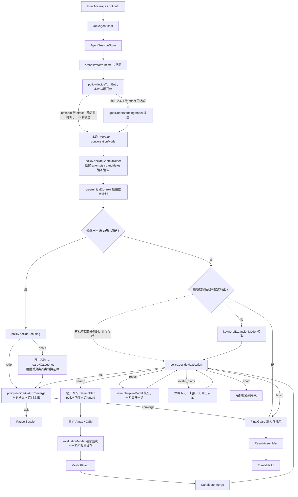

# ChiSha 今天吃啥

> 一个基于 Agent 的餐厅推荐应用。用户用自然语言描述需求，系统理解目标、搜索附近餐厅、验证候选，再用转盘帮助做最终选择。

[](https://www.typescriptlang.org/)
[](https://nextjs.org/)
[](https://react.dev/)

## 给新开发者的第一句话

这个项目不是“把用户输入丢给 LLM，然后让 LLM 返回餐厅”。

正确理解是：

1. LLM 负责理解用户目标、提出下一步 action、做候选语义验证。
2. Runtime 负责执行 loop、调用工具、控制预算、保存状态。
3. Guard 和 FinalGuard 负责安全边界和主推荐准入。
4. 搜索工具只返回餐厅事实，不判断用户到底该吃什么。
5. 前端只展示 Agent 状态、问题、候选和转盘结果，不推断 Agent 内部逻辑。

如果你刚开始做 Agent 开发，请先记住一个原则：模型可以建议，系统必须验证。

## 快速开始

### 前置要求

- Node.js 18 或更高版本
- npm
- OpenAI 兼容 API Key
- 高德地图 Web 服务 API Key
- 可选：Cloudflare D1，用于生产环境持久化 Agent session

### 安装与启动

```bash
npm install
cp .env.example .env.local
npm run dev
```

访问 http://localhost:3000。

### 最小环境变量

```env
OPENAI_API_KEY=sk-...
OPENAI_BASE_URL=https://api.openai.com/v1
OPENAI_MODEL=deepseek-v4-flash-0731
# 兼容旧 OpenAI-compatible 端点时可选
# OPENAI_TOOL_CALL_MODE=functions
# Qwen/DashScope 强制工具调用会自动关闭 thinking mode；通常不要改
# QWEN_ENABLE_THINKING=false

AMAP_API_KEY=...
NEXT_PUBLIC_AMAP_KEY=...
AMAP_SECURITY_CODE=...

NEXT_PUBLIC_APP_URL=http://localhost:3000
LOG_LEVEL=info
```

完整变量见 [环境变量](#环境变量)。

## 常用命令

```bash
# 开发
npm run dev

# 类型检查
npm run type-check

# ESLint
npm run lint

# 测试
npm test
npm run test:ci
npm run test:watch
npm run test:coverage

# Next.js 构建
npm run build

# Cloudflare Workers 构建与部署
npm run build:cloudflare
npm run deploy

# Cloudflare D1 迁移
npm run db:migrate:local
npm run db:migrate:remote
```

## 技术栈

- Next.js 16 App Router
- React 18
- TypeScript 5.6
- Tailwind CSS 3.4
- Zod
- OpenAI 兼容模型接口
- 高德地图 Web 服务 API
- OpenStreetMap fallback
- Jest + React Testing Library
- Cloudflare Workers / D1

## Agent 架构总览

**编排者是代码，不是模型。** 没有"主 Agent 模型"这种东西——`orchestrator/`
决定一切流程，四个结构化模型角色各做一件独立任务。核心原则是**模型只做代码枚举不了的事**：

这是当前实现事实，不是目标架构。目标形态是 Anthropic 术语下的
`RestaurantSearchLeadAgent` + specialized subagents；迁移边界与顺序以
`docs/specs/restaurant-search-agent.md` 和
`docs/technical/agent-architecture-root-decision-2026-08.md` 为准。

| 层 | 谁 | 负责什么 |
|---|---|---|
| 编排（代码） | `orchestrator/policy.ts` | **唯一决策者**：本轮从哪开始、搜哪些词、够不够、要不要追问、何时收敛。纯函数，无 I/O 无模型 |
| 编排（代码） | `orchestrator/runtime.ts` | **只执行**：按决策发起调用、发 SSE、提交状态与 trace |
| 模型角色（模型） | `goalUnderstandingModel` | 理解口语、维护 `UserGoal`、判断信息够不够 |
| 模型角色（模型） | `keywordExpansionModel` | 把目标扩成更容易命中 POI 的搜索词与探索方向 |
| 模型角色（模型） | `evaluationModel` | **逐家**判断 POI 是否满足目标（不选择、不排序） |
| 模型角色（模型） | `searchReplanModel` | 确定性关键词试完仍无主推荐时重新构思方向，一轮最多一次 |
| 规则库（代码） | `goal.ts` / `guards.ts` / `finalGuard.ts` 等 | 同样输入永远同样输出，不含语义判断 |

依赖方向只允许三条：编排层→模型角色、编排层→规则库、模型角色→规则库。
**这条约束由 `__tests__/lib/agent/layering.test.ts` 强制**，违反即测试红；
模型角色的输入不得含编排状态，由 `modelRoleContracts.test.ts` 强制。

演进过程：动作决策从模型收回到代码见
`docs/agent-loop-shape-review-2026-08.md`；角色正名与模型角色解耦见
`docs/Agent-职责边界重构-技术方案-2026-08.md`。



读图说明：方框里的 `policy.*` 是决策函数（纯函数，给状态就能单测）；
菱形是 runtime 里剩下的两个分支——它们只是转发上游已经做出的判断
（模型角色说要追问、放宽授权已让候选转正），不自行选择动作。
`decideContextReset` 不产生分支，它只算出"清空哪些状态"交给
`createInitialContext` 执行。

### 一次推荐发生了什么

1. 用户输入：“附近想吃便宜点的川菜，不要太远。”
2. `/api/agent/chat` 校验请求，加载或创建 session。
3. `policy.decideTurnEntry` 分派：点了带 effect 的追问选项就确定性打补丁
   （**全程不调模型**）；自由文本才交给 `goalUnderstandingModel` 理解。
4. `policy.decideContextReset` 按会话模式决定要不要作废已搜到的东西。
   注意分工：“这句话与上文什么关系”是语义判断，归模型角色；
   “因此要不要清空”是策略判断，归 policy。
5. 需要先问清楚时，`policy.decideScouting` 判断要不要先探一次路——用户没说
   想吃什么时，先搜一次拿到附近真实品类分布，再据此生成追问选项，避免模型
   凭空复述自己 prompt 里的例子。`decideAskOrConverge` 用问题指纹挡住
   “同一个问题连问两次”。
6. `keywordExpansionModel` 生成同义词与探索方向。**首批 exact 搜索不依赖它，
   两者并发**——首批只用得到 `UserGoal.primaryKeywords`。
7. `policy.decideNextAction` 决定下一步：搜索（一次铺开整批计划）、结束、
   追问、replan，或在验证不可用时 abort。计划在 policy 内部就过了
   `validateSearchPlan`——任何违规都是编程错误，会以 `invalid_plans` 决策
   显式报出来，**不改写、也不请求重写**。
8. 批内计划并行调用高德，失败时 fallback 到 OSM。
9. `evaluationModel` 逐家验证候选，只出裁决、不做选择与排序。一轮内同一家店
   只判一次（`evaluationCache.ts`）。
10. `VerdictGuard` 清理模型 verdict 中不合法的内容。
11. `FinalGuard` 决定哪些候选能进入主推荐，并按裁决内容与距离确定性排序；
    开放推荐时按搜索方向轮转，避免单一品类吃满转盘。
12. 前端收到 SSE 事件，展示进度、追问、结果和转盘。同一步的并发计划按
    `planId` 聚合展示。

## 核心概念

### UserGoal

`UserGoal` 是“用户到底想要什么”的结构化表达。

它应该包含：

- 用户明确想吃的菜品或菜系
- 距离、预算、营业状态等硬约束
- 环境好、人气高、清淡点等软偏好
- 是否允许放宽
- 是否还需要追问

它不应该包含：

- 餐厅事实
- 搜索结果
- 编造出来的菜单、评分或距离
- 高德 POI typecode 的自由生成结果

相关文件：

- `lib/agent/types.ts`
- `lib/agent/schemas/goal.ts`
- `lib/agent/models/goalUnderstandingModel.ts`（目标理解，模型）
- `lib/agent/goal.ts`（目标代数：合并、打补丁、追问选项应用，纯函数）

### SearchPlan

`SearchPlan` 是“下一次该怎么搜索”的计划。

它应该包含：

- 单个或少量餐饮搜索词
- 搜索半径
- 搜索意图：`exact`、`synonym`、`broadened`、`fallback`
- 是否允许结果进入主推荐
- 搜索理由

注意：高德 POI 搜索中，`keywords` 不要把多个无关意图合成一个字符串，例如不要生成 `川菜|咖啡|奶茶`。多个意图应该拆成多次搜索——这条约束已经写进
`SearchPlanSchema`（`keywords` 长度恒为 1），多个意图由 `planSearchBatch`
铺成同一批里的多个计划并行执行。

计划全部由 `policy.ts` 生成，模型不再产出 `SearchPlan`。

相关文件：

- `lib/agent/schemas/plan.ts`
- `lib/agent/orchestrator/policy.ts`（唯一生成方）
- `lib/agent/guards.ts`（`validateSearchPlan`）
- `lib/agent/orchestrator/runtime.ts`
- `lib/agent/poiTaxonomy.ts`

### CandidateVerdict

`CandidateVerdict` 是 `EvaluationModel` 对餐厅候选的判断。

它应该回答：

- 这家餐厅是否通过验证
- 是否能进入主推荐
- 命中了哪些菜品或品类
- 有哪些冲突或警告
- 证据来自哪些输入事实

它不应该做：

- 编造菜单
- 编造评分
- 编造营业状态
- 绕过硬约束
- 直接决定最终主推荐

相关文件：

- `lib/agent/models/evaluationModel.ts`
- `lib/agent/schemas/verdict.ts`
- `lib/agent/guards.ts`
- `lib/agent/evaluator.ts`

### 主推荐与候补

主推荐是可以进入转盘的核心结果。候补是可展示但不参与主推荐准入的结果。

主推荐必须满足：

- `verification.status === 'passed'`
- `verification.primaryEligible === true`
- 没有硬约束失败
- 来自允许进入主推荐的 search attempt
- 没有被 FinalGuard 拒绝

候补可以包含：

- 未完全验证但没有明确失败的候选
- 未授权放宽搜索得到的候选
- 数据源字段不足的候选

相关文件：

- `lib/agent/finalGuard.ts`
- `lib/agent/resultAssembler.ts`
- `components/HomePage.tsx`

## 模块职责边界

### `app/api/agent/chat/route.ts`

职责：

- 校验请求体。
- 加载或创建 Agent session。
- 通过 SSE 返回 Agent 事件。
- 注入搜索工具实现。
- 保存 runtime 结果。

不要做：

- 不要在 route 层判断用户意图。
- 不要在 route 层决定推荐策略。
- 不要在 route 层编写候选验证逻辑。
- 不要把 pending question 当成唯一续跑条件。新架构下，有效 `sessionId` 应代表一段可持续会话。

### `lib/agent/orchestrator/runtime.ts`

职责：

- 执行 policy 给出的决策，不自行推导下一步。
- 调用四个结构化模型角色与搜索工具。
- 控制 action 次数和评价 batch。
- 并行执行批内搜索计划，串行提交结果（保证 `sourceAttempt` 索引稳定）。
- 触发 guard 和 FinalGuard。
- 生成 SSE 事件和 runtime state。

为什么这些职责合理：

- Runtime 相当于 Agent 的宿主环境，不是模型本身。
- 模型可以提出 action，但工具调用必须由 Runtime 执行。
- 搜索预算、超时、并发、POI type 合法性、半径限制都属于确定性控制，不能交给模型自由决定。
- FinalGuard 和 hard guard 是事实边界，必须由 Runtime 编排执行。
- session、trace、pause、resume 是系统状态，也应由 Runtime 或 Runtime 调用的状态层管理。

不要做：

- 不要把 Runtime 变成第二个 Planner——所有决策只能写在 `orchestrator/policy.ts`。
  判据：这里不该出现决定"下一步动作类型"的 `if`。
- 不要静默改写 policy 给出的计划。计划非法说明 policy 有 bug，应该报出来。
- 不要让未验证候选进入主推荐。

Runtime 的边界：

| Runtime 可以做 | Runtime 不应该做 |
|---|---|
| 执行 loop | 理解用户到底想吃什么 |
| 调用模型子模块 | 自己推导"下一步搜什么" |
| 调用 Amap/OSM 工具 | 编造或修改餐厅事实 |
| 限制预算、半径、并发 | 静默把一个 action 改成另一个 action |
| 调用 Guard / FinalGuard | 把未验证候选提升为主推荐 |
| 保存 session / trace | 在前端或存储层补业务规则 |

计划不合法时：记 `guard_decision` trace + `logger.error`，把该批标记为已尝试，
重新向 policy 要决策。**不要就地改写，也不要请求模型重写**——后者在 guard
已经算出替代方案之后再花一次模型往返，只可能亏。

### `lib/agent/orchestrator/policy.ts`

职责：

- **唯一决策者**，纯函数、无 I/O、无模型：
  - `decideTurnEntry` 本轮从哪开始（optionId 分派 / 交给模型理解）
  - `decideContextReset` 要不要作废已搜到的东西
  - `decideScouting` 追问前要不要先探一次路
  - `decideNextAction` 搜索 / 结束 / 追问 / replan / abort / invalid_plans
  - `decideAskOrConverge` 问题指纹与连问上限
  - `planSearchBatch` 一次铺开整批搜索计划；`partitionPlansByValidity` 自校验
- 计划构造、半径递增、poiType 选择、关键词队列。
- 追问文案与授权 effect（`buildNoPrimaryQuestion` / `buildBroadenEffect`）。
- 阈值集中在 `POLICY_LIMITS`。

不要做：

- 不要做语义理解——那是 `goalUnderstandingModel` 的事。
- 不要 import 模型角色或 `modelClient`——那会破坏"能不 mock 就单测"的性质，
  `layering.test.ts` 会红。
- 不要做候选准入——那是 FinalGuard 的事。
- 不要在 runtime 或 guard 里另写一份顺序决策。
- 不要把阈值散落到各处：改行为就改 `POLICY_LIMITS`。

分支优先级（即 `decideNextAction` 的顺序）：够了就结束 > 预算耗尽 >
有未授权候补就请求授权 > 还有可搜的就搜 > 有主推荐就结束 > 还能重新构思
就 replan > 追问。

一个刻意的策略：**一个结果都没有时优先换镜头，而不是加深同一个镜头**。
批次里放 1 个同义词 + 相邻品类，而不是把预算全花在同义词穷举上。

### `lib/agent/models/searchReplanModel.ts`

职责：

- `runSearchReplan`：确定性关键词全部试完仍无主推荐时重新构思方向，
  一轮最多一次，可返回新搜索词或一个追问；返回 `null` 时回落模板追问。

不要做：

- 不要执行搜索。
- 不要编造候选。
- 不要调用高德或 OSM。
- 不要生成或修改餐厅事实。
- 不要自由生成高德 POI typecode。
- 不要把“不辣”“都可以”“环境好”这类非餐饮目标塞进搜索关键词。
- **不要重新承担常规轮次的 action 决策**——那是 `policy.ts` 的职责。

### `lib/agent/models/keywordExpansionModel.ts`

架构定位：

- 它只生成搜索词和 POI type 建议，不决定是否继续搜，也不决定搜索结果
  能否进入主推荐。
- 它拿到的是编排层算好的 `mode`（`expand_targets` / `open_exploration`），
  不用自己从 `authorizations` 推断当前处于哪个阶段。
- 模型失败即报错。**不要再加"用固定词表替它选方向"的兜底**——那两张表
  （小吃/中餐/快餐、日料降权）已在职责边界重构中删除。

职责：

- 把明确的餐饮目标扩展成更容易命中 POI 的搜索词。
- 为每个 keyword 建议匹配的餐饮 POI type。
- 开放推荐时生成少量多样探索词。

不要做：

- 不要根据软偏好乱猜菜系。
- 不要把否定条件变成搜索词。
- 不要生成多个意图合并的 keyword。
- 不要让多个 keyword 共享一个不匹配的窄 POI type。

### `lib/agent/models/evaluationModel.ts`

职责：

- 基于餐厅事实字段验证候选。
- 输出 `passed`、`failed` 或 `unverified`。
- 给出 evidence、warnings、conflicts。
- 提供排序建议。

不要做：

- 不要编造菜单、人均、评分、营业状态或距离。
- 不要把字段不足的候选直接标记成主推荐。
- 不要替代 FinalGuard。
- 不要实现 deterministic verifier fallback。

重要约束：如果 `EvaluationModel` 失败，系统可以重试、缓存命中、暂停、报错或只返回未验证候补，但不能用本地规则生成 `passed` verdict。

### `lib/agent/evaluationCache.ts`

职责：

- 一轮内同一家餐厅只送一次 `EvaluationModel`。高德对相邻关键词会返回大量
  重叠 POI，而 Evaluation 是调用量最大的 agent。
- 并发批次下用申领机制协调：同一家店只由一个计划评估，其余等待结果。

三条刻意的边界（改这个文件前先读它们）：

1. 缓存的是**模型原始裁决**，不是准入结论。`primaryEligible` 仍要在
   `applyVerdictGuard` 里与当轮 plan 的 `allowedForPrimary` 相与。
2. **只在一轮内复用**。跨轮的裁决存在 `runtimeState.candidates` 里，但那份
   `primaryEligible` 是 guard 之后（甚至被 broadenAdmission 提升过）的值。
3. **只复用 `passed`，且产出它的镜头不比当前更宽**。「寿司专门店」在
   「日本料理」下判失败、在「寿司」下应当通过——failed / unverified 一律重判。

### `lib/agent/guards.ts`

职责：

- `validateSearchPlan`：校验 policy 生成的计划（schema、排除项、严格距离、
  重复计划）。**只校验并拒绝，不改写字段，也不请求重写。**
- 在模型 verdict 后再次检查硬约束。
- 清理未观察 id。
- 阻止未授权候选进入主推荐。
- 合并冲突和警告。

不要做：

- 不要生成新的语义判断。
- 不要把 `unverified` 改成 `passed`。
- 不要作为隐藏策略层替 Agent 重新规划。
- 不要"顺手修好"非法计划——那会掩盖 policy 的 bug。

### `lib/agent/finalGuard.ts`

职责：

- 最终决定主推荐和候补。
- 拒绝未通过验证、硬约束失败、未授权放宽或候选版本不匹配的餐厅。
- 为开放推荐做稳定随机排序。

不要做：

- 不要编造推荐理由。
- 不要提升未验证候选。
- 不要绕过用户明确排除项。

### `lib/agent/session.ts`、`d1SessionStore.ts`

职责：

- 保存 Agent session。
- 保存 messages、goal、attempts、candidates、actions、observations。
- 在生产环境通过 Cloudflare D1 持久化。

新架构下还应承担：

- 保存 Agent trace。
- 保存 goal version。
- 保存 candidate 验证版本。

不要做：

- 不要在 SessionStore 里写业务策略。
- 不要只保存最终快照而丢失中间决策。

### `lib/amap.ts`、`lib/osm.ts`

职责：

- 调用外部 POI 数据源。
- 返回餐厅事实。
- 做 API 限流、缓存、重试、详情补全。

不要做：

- 不要判断用户需求。
- 不要决定主推荐。
- 不要把多个无关搜索意图强行合并。

### `hooks/useRestaurantSearch.ts`

职责：

- 调用 `/api/agent/chat`。
- 消费 SSE 事件。
- 更新前端进度、问题、结果。
- 按 `planId` 聚合同一步内并发计划的进度：关键词合并展示、`found` 累加。

不要做：

- 不要在前端重新解释用户意图。
- 不要根据餐厅字段自己过滤主推荐。
- 不要丢失 `sessionId` 和 pending question。
- 不要用覆盖式写入处理搜索事件——并发下后到的会盖掉先到的，用户只看得见
  最后一个关键词。

### `context/AppReducer.ts`

职责：

- 管理全局 UI 状态。
- 保存 restaurants、turntable、error、agent explanation 等。

新架构下建议增加：

- `AGENT_QUESTION`
- `agentSessionId`
- `agentQuestion`
- `agentTrace`

## 开发时最容易踩的坑

### 1. 把 prompt 当成唯一解决方案

如果模型经常输出错误结构，不要只继续加 prompt。优先检查：

- schema 是否足够明确
- Runtime 是否给了正确上下文
- Guard 是否把模型决策静默改掉
- trace 是否能看出真正失败点

### 2. 把软偏好写成硬约束

“环境好”“人气高”“适合约会”“清淡点”通常是软偏好。除非数据源有稳定字段，否则不要让它们阻止主推荐。

硬约束通常包括：

- 明确距离
- 明确预算
- 明确排除项
- 明确营业中
- 明确不吃某类

### 3. 把否定条件当搜索词

错误示例：

- 用户说“不吃辣”，搜索 `不辣`
- 用户说“都可以”，搜索 `都可以`
- 用户说“附近有什么”，搜索整句

正确做法：

- 否定条件进入 `hardConstraints` 或 `softPreferences`
- 缺少正向餐饮目标时追问
- 用户明确“随便/你决定”时才开放推荐

### 4. 让未验证候选进入主推荐

`unverified` 可以作为候补展示，但不能进入主推荐。尤其是用户明确想吃具体菜品时，模型必须有证据证明餐厅匹配。

### 5. 在 EvaluationModel 失败时做本地语义兜底

本项目明确不做 deterministic verifier fallback。

允许：

- 重试 EvaluationModel
- 使用相同输入的 evaluation cache
- 暂停并告知用户验证失败
- 返回候补但标记未验证

禁止：

- 本地规则把候选标记为 `passed`
- 用 POI type 直接替代语义验证
- 让未验证候选进入主推荐

### 6. 忘记 Amap POI 搜索规则

高德 POI 搜索要注意：

- `keywords` 应该是单一搜索意图。
- 不要把 `川菜|咖啡|奶茶` 放进一次 POI 请求。
- 多个意图应 fan out 成多次请求。
- 只有 keyword 和 type 匹配时才使用窄 `poiType`。
- 不确定时使用 broad catering type 或不传窄 type。

### 7. session 只按 pending question 续跑

新架构目标是：`sessionId` 表示一段 Agent 对话。用户完成一次推荐后继续说“换便宜点”，也应该能复用上下文，而不是新建完全独立搜索。

### 8. 忽略 trace

Agent bug 很难只从最终结果判断。开发新能力时要能回答：

- policy 这一步为什么选了这个决策（`runtime_decision` trace）
- Guard 是否拦截
- 搜索工具返回了什么
- EvaluationModel 为什么通过或拒绝，还是命中了缓存
- FinalGuard 为什么没有让某个候选进入主推荐

### 9. 只跑单测就改 loop 行为

单测锁的是分支，锁不住"这一轮总共搜了几步、评了几次、追没追问"。
改 `orchestrator/policy.ts` / `orchestrator/runtime.ts` / `evaluationCache.ts` 之后必须跑
`npm run eval`，并在 PR 里附基线 diff。

### 10. 并发化时忘了共享可变状态

首搜与联想词并发、批内计划并发之后，几个路径会同时写 `context`。
串行下安全的共享容器在并行下不一定安全——曾经就因为两个 metrics 容器
互相覆盖丢过一半调用记录。加并发时把"谁往哪个容器写"单独过一遍。

## 常见开发任务应该改哪里

### 新增一种用户约束

需要检查：

- `lib/agent/types.ts`
- `lib/agent/schemas/goal.ts`
- `lib/agent/models/goalUnderstandingModel.ts`
- `lib/agent/constraintEvaluator.ts`
- `lib/agent/guards.ts`
- `lib/agent/finalGuard.ts`
- 对应测试

不要只改 prompt。

### 新增一种 Agent SSE 事件

需要检查：

- `lib/agent/types.ts`
- `lib/api.ts`
- `hooks/useRestaurantSearch.ts`
- 前端展示组件
- API 测试

### 修改搜索策略

需要检查：

- `lib/agent/orchestrator/policy.ts`（顺序决策、批次、阈值——**先看这里**）
- `lib/agent/orchestrator/runtime.ts`
- `lib/agent/poiTaxonomy.ts`
- `lib/agent/models/keywordExpansionModel.ts`
- `__tests__/lib/agent/orchestrator/policy.test.ts`
- `__tests__/lib/agent/orchestrator/runtime.test.ts`
- `evals/cases/`（新策略要有对应的 golden case）

不要在 `lib/amap.ts` 里写用户策略，也不要把顺序决策写回 runtime 或 guard。

### 修改主推荐准入

需要检查：

- `lib/agent/finalGuard.ts`
- `lib/agent/guards.ts`
- `lib/agent/evaluator.ts`
- `lib/agent/resultAssembler.ts`
- FinalGuard 测试

不要在前端过滤主推荐。

### 修改多轮会话

需要检查：

- `app/api/agent/chat/route.ts`
- `lib/agent/session.ts`
- `lib/agent/models/goalUnderstandingModel.ts`
- `lib/agent/goalVersion.ts`
- `lib/agent/orchestrator/runtime.ts`
- `hooks/useRestaurantSearch.ts`
- `context/AppReducer.ts`
- session 相关测试

## 项目结构

```text
chisha/
├── app/
│   ├── api/
│   │   ├── agent/chat/       # Agent SSE 主入口
│   │   ├── agent/search/     # 兼容旧搜索入口
│   │   ├── agent/session/    # session 查询/删除
│   │   ├── search/           # 非 Agent 餐厅搜索
│   │   └── geocode/          # 地理编码
│   ├── layout.tsx
│   └── page.tsx
│
├── components/
│   ├── input/                # 输入和位置
│   ├── turntable/            # 转盘
│   ├── restaurant/           # 餐厅卡片和结果
│   ├── map/                  # 地图
│   └── layout/
│
├── context/
│   ├── AppContext.tsx
│   └── AppReducer.ts
│
├── hooks/
│   ├── useRestaurantSearch.ts
│   ├── useLocation.ts
│   └── useTurntable.ts
│
├── lib/
│   ├── agent/
│   │   ├── orchestrator/runtime.ts # 执行器
│   │   ├── orchestrator/policy.ts # 当前 workflow 的唯一 planner
│   │   ├── models/goalUnderstandingModel.ts # 目标理解（模型）
│   │   ├── models/searchReplanModel.ts # 重新构思方向（模型）
│   │   ├── evaluationCache.ts    # 一轮内候选裁决缓存
│   │   ├── session.ts
│   │   ├── d1SessionStore.ts
│   │   ├── guards.ts
│   │   ├── finalGuard.ts
│   │   ├── evaluator.ts
│   │   ├── resultAssembler.ts
│   │   ├── modelClient.ts
│   │   ├── metrics.ts
│   │   ├── poiTaxonomy.ts
│   │   ├── schemas/
│   │   └── models/
│   ├── amap.ts
│   ├── osm.ts
│   ├── api.ts
│   ├── logger.ts
│   └── withTimeout.ts
│
├── types/
├── docs/
├── evals/                        # Agent loop 行为评测集（npm run eval）
├── __tests__/
├── migrations/
├── package.json
└── README.md
```

## API 端点

### `POST /api/agent/chat`

Agent 对话搜索主入口。返回 `text/event-stream`。

请求示例：

```json
{
  "message": "附近便宜的川菜，不要太远",
  "location": {
    "lat": 39.9,
    "lng": 116.4,
    "address": "北京市朝阳区"
  },
  "sessionId": "optional-agent-session-id",
  "preferenceSummary": {
    "favoriteCuisines": [{ "name": "川菜", "weight": 0.8 }],
    "recentRejectedRestaurants": ["某某餐厅"]
  }
}
```

常见 SSE 事件：

- `thinking`
- `status`
- `heartbeat`（保活，客户端据此判断流是否卡死）
- `action`
- `tool_start`
- `tool_result`
- `searching`（并发批次下同一步会有多条，用 `planId` 区分）
- `search_result`（同上；`total` 是单个计划的数量，需要前端按批次累加）
- `observation`
- `guardrail`
- `partial_results`
- `question`
- `session_paused`
- `session_resumed`
- `final`
- `error`

### `POST /api/search`

非 Agent 搜索入口。主要用于兼容旧功能或单纯搜索。

### `POST /api/geocode`

地址转坐标。

### `POST /api/geocode/reverse`

坐标转地址。

## 环境变量

| 变量 | 必需 | 说明 | 默认值 |
|---|---|---|---|
| `OPENAI_API_KEY` | 是 | OpenAI 或兼容服务 API Key | - |
| `OPENAI_BASE_URL` | 否 | OpenAI 兼容 API 地址 | `https://api.openai.com/v1` |
| `OPENAI_MODEL` | 否 | Agent 使用的模型 | 代码默认 `deepseek-v4-flash-0731` |
| `OPENAI_TOOL_CALL_MODE` | 否 | 模型函数调用请求格式；默认使用 `tools/tool_choice`，旧兼容端点可设为 `functions` | - |
| `QWEN_ENABLE_THINKING` | 否 | Qwen/DashScope 兼容端点的 thinking mode 开关；强制工具调用场景默认自动关闭 | - |
| `AMAP_API_KEY` | 是 | 高德 Web 服务 API Key | - |
| `NEXT_PUBLIC_AMAP_KEY` | 否 | 前端地图 JS API Key；只用于浏览器加载高德 JS API，不要使用服务端 `AMAP_API_KEY` 代替 | - |
| `AMAP_SECURITY_CODE` | 否 | 高德安全码或签名密钥 | - |
| `AMAP_SAFE_QPS` | 生产建议显式配置 | 高德 Web 服务跨 Worker 安全起始速率；取控制台账号/服务/Key 最小 QPS 的 70% | `4` |
| `AMAP_MAX_QPS` | 否 | 旧部署兼容项，仅在未设置 `AMAP_SAFE_QPS` 时读取 | `4` |
| `AMAP_MAX_INFLIGHT` | 否 | 高德跨 Worker 最大在途请求数 | `6` |
| `AMAP_MAX_RETRIES` | 否 | 高德 QPS/网络错误重试次数 | `2` |
| `AMAP_DETAIL_CONCURRENCY` | 否 | 单次 Agent 运行的高德详情补全并发 | `2` |
| `AMAP_SEARCH_CACHE_TTL_MS` | 否 | POI 搜索页缓存时间 | `120000` |
| `AMAP_DETAIL_CACHE_TTL_MS` | 否 | POI 详情缓存时间 | `86400000` |
| `AMAP_GEOCODE_CACHE_TTL_MS` | 否 | 地理编码缓存时间 | `3600000` |
| `AGENT_MAX_SEARCH_CALLS` | 否 | 单轮新增搜索调用上限 | `4` |
| `AGENT_EVALUATION_BUFFER` | 否 | Evaluation 候选缓冲数 | `4` |
| `AGENT_EVALUATION_BATCH_SIZE` | 否 | Evaluation 批大小 | `6` |
| `AGENT_EVALUATION_CONCURRENCY` | 否 | Evaluation 并发数 | `2` |
| `AGENT_EVALUATION_LIMIT` | 否 | Evaluation 候选硬上限 | 未设置 |
| `AGENT_POI_PAGES_PER_SEARCH` | 否 | 每次 POI 搜索页数 | `2` |
| `AGENT_DETAIL_ENRICH_LIMIT` | 否 | 每次详情补全数量 | `6` |
| `AGENT_PARALLEL_SEARCH` | 否 | 设为 `false` 关闭一轮内并行搜索（每批只跑 1 个计划） | 开启 |
| `AGENT_SEARCH_CONCURRENCY` | 否 | 一批最多铺开几个搜索计划 | `3` |
| `AGENT_MAX_ACTIVE_RUNS` | 否 | 全站同时执行的 Agent turn 上限 | `3` |
| `AGENT_CONCURRENT_FIRST_SEARCH` | 否 | 设为 `false` 关闭"首搜与联想词并发" | 开启 |
| `AGENT_HEARTBEAT_MS` | 否 | SSE 心跳间隔；改动需同步 `lib/api.ts` 的超时阈值 | `10000` |
| `AGENT_DETERMINISTIC` | 否 | 设为 `1` 强制走确定性分支（测试默认开启） | - |
| `OPENAI_MODEL_SUPERVISOR` | 否 | 目标理解模型 | 继承 `OPENAI_MODEL` |
| `OPENAI_MODEL_PLANNER` | 否 | replan 模型 | 继承 `OPENAI_MODEL` |
| `OPENAI_MODEL_EVALUATION` | 否 | 候选验证模型，调用量最大，可配便宜模型 | 继承 `OPENAI_MODEL` |
| `OPENAI_MODEL_KEYWORD` | 否 | 关键词联想模型 | 继承 `OPENAI_MODEL` |
| `MODEL_MAX_INFLIGHT` | 否 | 同一模型端点与模型的跨 Worker 在途上限 | `4` |
| `MODEL_RPM_LIMIT` | 否 | 模型 RPM；未知时为 0，仅关闭该速率维度 | `0` |
| `MODEL_TPM_LIMIT` | 否 | 模型 TPM；发送前按估算 token 预留 | `0` |
| `OSM_SAFE_QPS` | 否 | OSM fallback 的跨 Worker 安全速率 | `1` |
| `OSM_MAX_INFLIGHT` | 否 | OSM fallback 最大在途请求数 | `1` |
| `PROVIDER_MAX_WAIT_MS` | 否 | Provider/运行名额的调用方短等待预算，范围 0–5000ms | `3000` |
| `PROVIDER_LEASE_TTL_MS` | 否 | 调度 lease TTL；长请求会自动续租 | `120000` |
| `SESSION_OWNER_SECRET` | 生产必需 | 至少 32 字符的高熵 HMAC 密钥，可用 `openssl rand -base64 48` 生成 | - |
| `NEXT_PUBLIC_APP_URL` | 否 | 应用 URL | `http://localhost:3000` |
| `LOG_LEVEL` | 否 | 日志级别 | `info` |
| `CHISHA_DB` | 生产必需 | Cloudflare D1 binding，用于持久化 session | - |
| `PROVIDER_SCHEDULER` | 生产必需 | Cloudflare Durable Object binding，用于跨实例容量和会话互斥 | - |

## 测试建议

Agent 相关测试集中在：

- `__tests__/lib/agent/orchestrator/policy.test.ts`（顺序决策与批次）
- `__tests__/lib/agent/orchestrator/runtime.test.ts`
- `__tests__/lib/agent/orchestrator/runtime.parallel.test.ts`
- `__tests__/lib/agent/evaluationCache.test.ts`
- `__tests__/lib/agent/models/goalUnderstandingModel.test.ts`
- `__tests__/lib/agent/models/searchReplanModel.test.ts`（replan）
- `__tests__/lib/agent/finalGuard.test.ts`
- `__tests__/lib/agent/guards.test.ts`
- `__tests__/lib/agent/models/evaluationModel.test.ts`
- `__tests__/app/api/agent/chat.test.ts`

新增 Agent 行为时，至少补三类测试：

1. schema 或类型默认值测试。
2. Runtime 行为测试。
3. API/session 续跑测试。

如果改主推荐准入，必须补 FinalGuard 测试。

如果改 Amap POI 搜索规则，必须补 `poiTaxonomy` 或 runtime POI type 测试。

模型决策路径默认被 `AGENT_DETERMINISTIC=1`（`jest.setup.js`）关掉。要覆盖
模型分支，在用例内 `delete process.env.AGENT_DETERMINISTIC` 并 mock
`@/lib/withTimeout` 的 `fetchWithTimeout`。

### Agent 行为评测（`npm run eval`）

单测锁的是分支，锁不住"这一轮总共搜了几步、评了几次、追没追问"。
`evals/` 用桩模型 + fixture 高德驱动真实 `runSearchAgentV3`，度量：

- 串行搜索步数（并发铺开的关键词只算一步）
- 评估调用数与重复评估数
- 追问率、主推荐数

改 `orchestrator/policy.ts` / `orchestrator/runtime.ts` / `evaluationCache.ts` 之后必须跑，并在 PR 里
附 `evals/baseline.json` 的 diff。新增策略要配套加 golden case。

`EVAL_MODE=live npm run eval` 会改用真实模型（需要 `OPENAI_API_KEY`），
用于 prompt 相关改动——prompt 的效果 offline 模式测不出来。

## 推荐阅读顺序

如果你是刚接触 Agent 开发的新同学，建议按这个顺序读：

1. 本 README。
2. [docs/agent-loop-shape-review-2026-08.md](./docs/agent-loop-shape-review-2026-08.md)
   ——为什么模型不再参与常规轮次的动作决策。
3. [docs/Agent-Loop-形态重构技术方案-2026-08.md](./docs/Agent-Loop-形态重构技术方案-2026-08.md)
   ——落地记录与踩过的坑（第 9 节）。
4. `lib/agent/types.ts`。
5. `lib/agent/orchestrator/policy.ts`——顺序决策都在这里。
6. `lib/agent/orchestrator/runtime.ts`。
7. `lib/agent/models/goalUnderstandingModel.ts`。
8. `lib/agent/finalGuard.ts`。
9. `__tests__/lib/agent/orchestrator/policy.test.ts` 与 `evals/cases/`。

更早的评审与方案（`docs/Agent优化技术方案.md`、`docs/agent-architecture-review.md`
等）保留作为演进记录，其中的架构描述已被上面两份取代，不要照着实现。

## 部署

本项目可作为 Next.js 应用运行，也支持 Cloudflare Workers。

常用命令：

```bash
npm run build
npm run build:cloudflare
npm run deploy
```

PR 和 `main` push 会运行 GitHub CI：type-check、lint、带覆盖率门禁的全量单测、Agent eval、
OpenNext 构建和 Cloudflare dry-run。PR 不应上传 Worker Version；Cloudflare Workers Builds
需在控制台关闭 non-production branch builds，只保留 `main` 生产构建。详见
[CI/CD 质量门禁与发布隔离](./docs/specs/ci-cd-quality-gates.md)。

首次引入或新增 Durable Object migration 时必须使用非版本化的 `npm run deploy`；
Cloudflare Version upload/PR 预览不能应用这类 migration。D1 migration 也由该项目命令
显式执行，直接运行 `npx wrangler deploy` 不具备同等行为。

生产环境如果使用 Cloudflare，需要配置 D1 binding：`CHISHA_DB`。如果缺少 D1 binding，代码会回退到内存 session store，不适合生产长期运行。

Fork 之后需要把 `wrangler.jsonc` 里的 `d1_databases[].database_id` 换成你自己的——
仓库里那个是原作者账号下的资源，你访问不了。用 `npx wrangler d1 create chisha` 生成。

详细部署说明见 [docs/DEPLOYMENT.md](./docs/DEPLOYMENT.md)。

### 部署到公网之前请先读 [SECURITY.md](./SECURITY.md)

本仓库不附带任何 API Key，你自建一份之后账单归你。有两件事直接决定你会不会被刷：

1. **限流依赖 Cloudflare 原生 ratelimit binding，别漏配。** `wrangler.jsonc` 的
   `ratelimits` 段少了哪个，对应入口就静默退回进程内存计数——在 Workers 上等于
   没有限流，`/api/agent/chat` 会用你的 `OPENAI_API_KEY` 无限跑模型。部署到
   Vercel 或自托管 Node 时这套 binding 不存在，要挂公开站点得自己接全局方案。
2. **`/_AMapService` 是公开路径**，服务端会给转发出去的请求注入
   `AMAP_SECURITY_CODE`。它只放行 JS API 实际需要的几条路径，
   不要改回通配转发。

### 数据与隐私

多轮会话会把这些内容明文存进 D1 的 `agent_sessions` 表（带 `expires_at` 过期清理）：

- 用户的经纬度与地址
- 完整的多轮对话原文
- 搜索历史与候选裁决

对外提供服务时这些属于个人信息，合规义务由部署者自行承担。高德 POI 数据仅可作为
运行时缓存，不得导出或再分发。

## 常见问题

### OpenAI API 调用失败怎么办？

部分 Agent 子模块或特定场景有确定性兜底，例如开放推荐、关键词扩展或 action 选择。但 `EvaluationModel` 不做 deterministic verifier fallback。EvaluationModel 失败时，不允许把本地规则生成的语义判断作为主推荐依据。

### 高德搜索无结果怎么办？

Agent 会尝试同义词、相邻品类或 fallback 搜索。Amap 失败时 API route 会 fallback 到 OSM。未授权放宽的 fallback 结果只能作为候补，不能自动进入主推荐。

### 为什么有些候选没有进入转盘？

通常是以下原因之一：

- 没通过硬约束。
- EvaluationModel 判断为 `unverified` 或 `failed`。
- 来自未授权放宽搜索。
- FinalGuard 判定不能进入主推荐。
- 候选对应旧 goal 或旧 location，应该重新验证。

### 为什么不能直接让模型决定所有事？

餐厅推荐涉及距离、预算、营业状态、排除项等事实约束。模型可以理解和建议，但最终准入必须由可审计的 Runtime 和 Guard 控制。

### 修改 prompt 能解决所有问题吗？

不能。Agent 问题通常同时涉及 prompt、schema、上下文、工具结果、guard、session 和前端状态。先看 trace 和测试，再决定改哪一层。

## 参与贡献

见 [CONTRIBUTING.md](./CONTRIBUTING.md)。提 PR 前请跑：

```bash
npm run type-check && npm run lint && npm test
```

改动 `lib/agent/` 下的 policy / runtime / 缓存时，还要跑 `npm run eval` 并在 PR
里附上与基线的 diff——单测锁的是分支，eval 锁的是"这一轮总共搜了几步、评了几次"。

安全问题请走 [SECURITY.md](./SECURITY.md) 里的私密通道，不要开公开 issue。

## 相关文档

- [SECURITY.md](./SECURITY.md) — 漏洞报告与自建部署的安全注意事项
- [CONTRIBUTING.md](./CONTRIBUTING.md) — 贡献流程与代码规范
- [docs/Agent优化技术方案.md](./docs/Agent优化技术方案.md)
- [docs/agent-architecture-review.md](./docs/agent-architecture-review.md)
- [docs/DEPLOYMENT.md](./docs/DEPLOYMENT.md)
- [docs/TESTING.md](./docs/TESTING.md)
- [docs/QUICKSTART.md](./docs/QUICKSTART.md)
- [docs/archive/](./docs/archive/) — 各阶段完成报告，历史存档，不再维护
