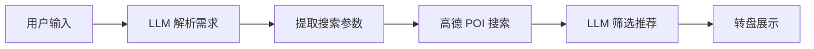
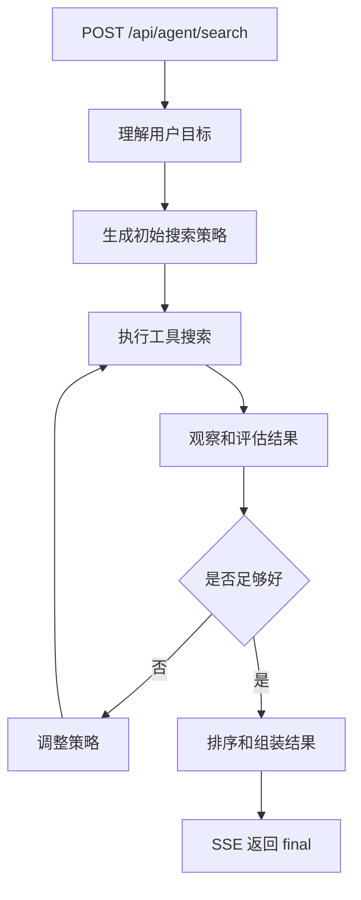

# AI 架构分析与 Agent 化重设计方案

> **历史方案，仅作演进记录。** 本文描述的早期 Agent 化方案已被后续 workflow 改造和
> 当前 orchestrator-workers 决策取代。当前依据见
> `docs/technical/agent-architecture-root-decision-2026-08.md`。

> 本文档分析 ChiSha 当前 AI 实现的 Workflow 模式局限性，并给出可落地的 Agent 化重设计方案。方案分为“先改核心 Agent Loop，再扩展多轮对话和记忆系统”，避免一次性大重构。

---

## 一、现状分析：当前架构是如何工作的

### 1.1 当前数据流（Workflow 模式）



当前系统虽然在 `/api/agent/search` 路由中使用了 Vercel AI SDK 的 `streamText` + `tool`，表面上看像是 Agent，但实际上是一个**伪装成 Agent 的 Workflow**。

### 1.2 为什么说它是 Workflow 而非 Agent

| 维度 | 真正的 Agent | 当前实现 |
|------|-------------|---------|
| 决策自主性 | 根据环境反馈自主决定下一步 | 固定流程：搜索 -> 凑够 8 家 -> 结束 |
| 目标驱动 | 持续追求目标，动态调整策略 | 硬编码目标（8 家），无策略调整 |
| 环境感知 | 感知并理解搜索结果质量 | 只看数量，不评估质量 |
| 反思能力 | 可以反思结果并改进 | 无反思，搜到就完事 |
| 多轮对话 | 可以与用户交互澄清需求 | 单次输入，无法追问 |
| 记忆与学习 | 记住用户偏好，越用越准 | 无记忆，每次重新开始 |
| 错误恢复 | 智能降级和备选策略 | 简单 fallback，降级到关键词匹配 |

### 1.3 当前实现的具体问题

#### 问题 1：搜索策略是硬编码的

```typescript
// route.ts - Agent 被强制要求凑够 8 家就停止
const AGENT_SYSTEM_PROMPT = `...
核心规则：
2. 找到8家餐厅后立即调用 finish_search 结束
3. 最多搜索3次就必须结束，不要犹豫
...
重要：达到8家餐厅后立即调用 finish_search，不要继续搜索！`;
```

Agent 没有自主权，它被强制要求“找到 8 家就停”。这意味着：

- 搜到 8 家质量很差的餐厅也会直接返回
- 无法根据搜索结果质量决定是否需要换策略
- 无法根据用户需求的复杂程度动态调整搜索深度

#### 问题 2：无法处理复杂/模糊需求

用户说“想找个环境好的地方和朋友聚餐，预算 300 左右”，当前系统只能：

1. 提取关键词，如 `["聚餐", "餐厅"]`
2. 搜索高德 POI，返回附近餐厅
3. 无法可靠处理“环境好”“聚餐”“预算”这些约束和偏好

#### 问题 3：没有多轮交互能力

用户说“随便吃点”，系统只能猜测并返回结果，无法追问：

- “想吃正餐还是小吃？”
- “有没有忌口？”
- “更看重近、便宜，还是环境？”

#### 问题 4：无法利用搜索结果反馈

搜到的餐厅可能和需求弱相关，但当前系统无法：

- 评估结果质量
- 过滤掉明显不合适的结果
- 根据结果调整搜索策略
- 说明哪些需求无法由当前数据源验证

#### 问题 5：没有用户偏好记忆

每次搜索完全独立，即使用户总是选择某类餐厅、删除某类餐厅，系统也无法学习和利用这些偏好。

---

## 二、设计结论：分阶段 Agent 化，而不是一次性推翻

### 2.1 目标

把当前“固定搜索流水线”改造成“目标驱动 Agent”：

> 根据用户当前意图、位置、历史偏好和可用数据源，主动规划搜索策略；根据工具返回结果观察质量；必要时放宽条件、换关键词、追问用户或说明无法满足的约束。

### 2.2 关键取舍

不建议第一阶段直接实现完整 ChatPanel、长期记忆、会话持久化和复杂 Reflection Engine。原因是当前产品已有转盘流程和 SSE 搜索体验，直接大改会扩大风险。

更稳的路径是：

1. **Phase 1：重构 `/api/agent/search` 为真正 Agent Loop**
   - 保留现有 API、SSE、Amap、转盘和候补池
   - 去掉“搜够 8 家立即结束”的强提示
   - 增加目标解析、策略规划、搜索观察、质量评估、策略调整、最终说明

2. **Phase 2：增加可暂停的多轮追问**
   - SSE 仍然只负责服务端到客户端推送
   - Agent 需要追问时返回 `question` 事件并结束当前请求
   - 用户回复通过新请求携带 `sessionId` 继续

3. **Phase 3：增加偏好记忆**
   - 前端先从本地历史记录生成偏好摘要，每次请求传给后端
   - 后续如需要登录态，再迁移到服务端持久化

4. **Phase 4：补齐外部数据能力**
   - 高德详情、营业状态、评分、人均、图片、预约等能力按需接入
   - 不让模型承诺当前数据源无法验证的信息

---

## 三、Phase 1：最小可落地 Agent Loop

### 3.1 Phase 1 架构



### 3.2 Agent 状态模型

```typescript
interface AgentContext {
  query: string;
  location: Location;
  preferenceSummary?: UserPreferenceSummary;

  goal: UserGoal;
  attempts: SearchAttempt[];
  candidates: RestaurantCandidate[];
  unmetConstraints: string[];

  maxSteps: number;        // 建议 6-8
  maxSearchCalls: number;  // 建议 4-5
  targetCount: number;     // 默认 8
}

interface UserGoal {
  intent: 'find_restaurants';
  hardConstraints: Constraint[];     // 必须满足，如距离、不吃辣、预算上限
  softPreferences: Preference[];     // 尽量满足，如适合约会、环境好
  exclusions: string[];              // 排除项，如不吃火锅
  ambiguity: string[];               // 信息不足或无法验证的点
}

interface SearchAttempt {
  keywords: string[];
  radius: number;
  poiType?: string;
  reason: string;
  found: number;
  accepted: number;
}

interface RestaurantCandidate {
  restaurant: Restaurant;
  score: number;
  matched: string[];
  warnings: string[];
  sourceAttempt: number;
}
```

### 3.3 Agent Loop 伪代码

```typescript
async function runSearchAgent(input: AgentInput, emit: EmitAgentEvent) {
  const context = createInitialContext(input);

  emit({ type: 'status', message: '正在理解你的需求...' });
  context.goal = await understandGoal(input);

  let strategy = await planInitialStrategy(context);

  while (!shouldStop(context)) {
    emit({
      type: 'tool_start',
      tool: 'search_places',
      args: strategy,
    });

    const restaurants = await searchPlaces(strategy, context.location);
    const observation = evaluateSearchResult(restaurants, context, strategy);

    mergeCandidates(context, observation.acceptedCandidates);

    emit({
      type: 'tool_result',
      tool: 'search_places',
      summary: {
        found: restaurants.length,
        accepted: observation.acceptedCandidates.length,
        total: context.candidates.length,
      },
    });

    if (isGoodEnough(context)) {
      break;
    }

    strategy = await replanStrategy(context, observation);
    if (!strategy) {
      break;
    }

    emit({
      type: 'strategy_change',
      reason: observation.reason,
      next: strategy,
    });
  }

  const result = finalizeRecommendations(context);
  emit({ type: 'final', ...result });
}
```

### 3.4 Phase 1 工具契约

Phase 1 的工具定义要克制：**只把需要外部观察或明确终止的能力暴露给 LLM**。候选评估、去重、放宽策略、排序兜底应放在 Agent Runtime 内部，不能伪装成工具让模型“走流程”。

工具设计原则：

- 工具返回事实，不返回主观结论
- 工具不修改全局状态，由 Runtime 合并状态
- 工具参数必须可校验，不能接受任意 prompt 文本
- LLM 只能选择下一次观察动作，不能绕过硬约束评估
- `finish_recommendation` 只是提交候选解释，最终仍由 Runtime 校验

#### LLM 可调用工具

```typescript
const AGENT_TOOLS = {
  search_restaurants: tool({
    description:
      '搜索当前位置附近的餐饮 POI。用于观察外部世界，不负责最终筛选。',
    inputSchema: z.object({
      keywords: z.array(z.string().min(1)).min(1).max(5),
      radiusMeters: z.number().int().min(300).max(5000),
      poiType: z.string().regex(/^\d{6}$/).optional(),
      searchIntent: z
        .enum(['exact', 'synonym', 'broadened', 'fallback'])
        .describe('本次搜索相对原始需求的放宽程度'),
      reason: z.string().min(1).max(120),
    }),
    outputSchema: z.object({
      source: z.literal('amap'),
      query: z.object({
        keywords: z.array(z.string()),
        radiusMeters: z.number(),
        poiType: z.string().optional(),
        searchIntent: z.enum(['exact', 'synonym', 'broadened', 'fallback']),
      }),
      restaurants: z.array(RestaurantSchema),
      providerMeta: z.object({
        rawCount: z.number(),
        truncated: z.boolean(),
      }),
    }),
  }),

  finish_recommendation: tool({
    description:
      '当已经有足够候选，提交最终推荐意图。Runtime 会再次校验和排序。',
    inputSchema: z.object({
      selectedIds: z.array(z.string()).min(1).max(8),
      candidateIds: z.array(z.string()).max(20).default([]),
      explanation: z.string().min(1).max(300),
      unmetConstraints: z.array(z.string()).default([]),
      confidence: z.number().min(0).max(1),
    }),
  }),
};
```

#### Runtime 内部模块

这些不是 LLM 工具，而是代码内的确定性模块：

```typescript
interface AgentRuntimeModules {
  goalParser: {
    parse(query: string, preferenceSummary?: UserPreferenceSummary): Promise<UserGoal>;
  };

  planner: {
    initialPlan(goal: UserGoal): SearchPlan;
    nextPlan(context: AgentContext, observation: Observation): SearchPlan | null;
  };

  evaluator: {
    evaluate(restaurants: Restaurant[], context: AgentContext): RestaurantCandidate[];
    isGoodEnough(context: AgentContext): boolean;
  };

  resultAssembler: {
    finalize(context: AgentContext, proposed?: FinishRecommendation): AgentFinalResult;
  };
}
```

这样边界更清楚：LLM 负责“下一步搜什么”和“为什么可以结束”；Runtime 负责“事实是否满足约束”和“最终是否允许结束”。

### 3.5 评估规则：先确定性，后 LLM

结果质量不能只靠模型判断。建议按以下顺序评估：

1. **硬约束过滤**
   - 距离超过上限的降权或过滤
   - 明确“不吃辣”时过滤川菜、湘菜、火锅、烧烤等高风险类型
   - 明确排除某品类时，名称、菜系、搜索关键词命中则过滤

2. **相关性评分**
   - 名称命中关键词
   - 高德 `type` / `typecode` 匹配
   - 菜系和用户意图匹配
   - 距离越近加分，但不能压过硬约束

3. **软偏好评分**
   - “约会”“聚餐”“清淡”“赶时间”等偏好映射到候选类型
   - 当前数据源无法验证的偏好只做弱推断，并进入 `warnings`

4. **LLM 语义排序**
   - 只在候选数量足够时使用
   - 输入给 LLM 的是候选摘要，不让它编造评分、人均或营业状态
   - 输出必须是结构化排序和理由

### 3.6 策略调整规则

当结果不够好时，Agent 应该按顺序调整：

1. 同义词扩展：`日料 -> 日本料理 -> 寿司/拉面`
2. 品类上卷：`潮汕牛肉火锅 -> 牛肉火锅 -> 火锅`
3. 半径扩大：`1000m -> 2000m -> 3000m`
4. 放宽软偏好：保留硬约束，只放宽“环境好”“适合聊天”等弱可验证偏好
5. 返回不足说明：如果仍不足，返回最佳结果和 `unmetConstraints`

示例：

```typescript
{
  restaurants: [...],
  candidates: [...],
  explanation: '附近潮汕牛肉火锅较少，已补充牛肉火锅和其他火锅作为候补。',
  unmetConstraints: ['只找到 1 家明确匹配“潮汕牛肉火锅”的餐厅']
}
```

### 3.7 SSE 事件设计

保留现有事件，但新增更通用的事件。前端可以先只处理旧事件，新事件逐步接入。

```typescript
type AgentEvent =
  // 兼容现有前端
  | { type: 'thinking'; message: string }
  | { type: 'searching'; keywords: string[]; round: number }
  | { type: 'search_result'; found: number; total: number; restaurants: SearchResultRestaurant[] }
  | { type: 'filtering'; message: string; total: number }
  | { type: 'done'; restaurants: Restaurant[]; candidates: Restaurant[] }
  | { type: 'error'; message: string }

  // 新增 Agent 事件
  | { type: 'status'; message: string }
  | { type: 'tool_start'; tool: string; args: unknown }
  | { type: 'tool_result'; tool: string; summary: unknown }
  | { type: 'strategy_change'; reason: string; next: unknown }
  | { type: 'partial_results'; restaurants: SearchResultRestaurant[] }
  | {
      type: 'final';
      restaurants: Restaurant[];
      candidates: Restaurant[];
      explanation: string;
      unmetConstraints: string[];
    };
```

---

## 四、Phase 2：多轮追问和会话续跑

### 4.1 重要工程约束

SSE 是服务端到客户端的单向流，不能当成“双向通信”。Agent 需要追问用户时，不应该在 serverless route 里挂起 `Promise` 等用户回复。

正确模型是：

1. 当前请求运行 Agent
2. Agent 判断需要追问
3. 服务端发送 `question` 事件，并返回 `sessionId`
4. 当前 SSE 请求结束
5. 用户回复后，前端发起新的 `POST /api/agent/chat` 请求，带上 `sessionId` 和回复
6. 服务端恢复会话状态并继续 Agent Loop

### 4.2 API 设计

```text
POST /api/agent/search
  兼容现有单轮搜索；Phase 1 继续使用。

POST /api/agent/chat
  多轮 Agent 入口，输入 message、location、sessionId?，返回 SSE。

GET /api/agent/session/:id
  可选。用于恢复会话状态。

DELETE /api/agent/session/:id
  可选。用于结束会话。
```

### 4.3 多轮事件

```typescript
type ConversationEvent =
  | { type: 'message'; content: string }
  | {
      type: 'question';
      sessionId: string;
      question: string;
      options?: string[];
      allowFreeText: boolean;
    }
  | { type: 'session_paused'; sessionId: string }
  | { type: 'session_resumed'; sessionId: string };
```

### 4.4 会话状态

```typescript
interface AgentSession {
  id: string;
  createdAt: number;
  updatedAt: number;
  location: Location;
  messages: AgentMessage[];
  goal?: UserGoal;
  attempts: SearchAttempt[];
  candidates: RestaurantCandidate[];
  pendingQuestion?: {
    question: string;
    options?: string[];
  };
}
```

存储选择：

- 本地开发：内存 Map 足够验证体验
- 无登录生产：前端 LocalStorage/IndexedDB 保存 session，下一次请求带回后端
- 有登录生产：服务端 KV/数据库保存 session

---

## 五、Phase 3：记忆和个性化

### 5.1 不建议一开始做完整 Memory System

长期记忆应该先从“偏好摘要”做起，不要第一版就引入复杂用户画像和学习系统。

当前项目已经有历史记录能力，可以先在前端从历史记录生成摘要：

```typescript
interface UserPreferenceSummary {
  favoriteCuisines: Array<{ name: string; weight: number }>;
  avoidedCuisines: Array<{ name: string; weight: number }>;
  preferredDistanceMeters?: number;
  preferredPriceRange?: { min?: number; max?: number };
  recentSelectedRestaurants: string[];
  recentRejectedRestaurants: string[];
}
```

请求时带给后端：

```typescript
interface AgentSearchRequest {
  query: string;
  location: Location;
  preferenceSummary?: UserPreferenceSummary;
}
```

### 5.2 偏好学习信号

| 信号 | 权重 | 说明 |
|------|------|------|
| 转盘最终选中 | 强正向 | 用户实际接受了这个结果 |
| 手动删除餐厅 | 中等负向 | 可能是不喜欢，也可能只是想换一个 |
| 从候补池添加 | 中等正向 | 用户主动恢复兴趣 |
| 点赞/踩 | 强信号 | 后续可加显式反馈 |
| 搜索词 | 弱正向 | 表示当次兴趣，不一定是长期偏好 |

### 5.3 后端如何使用偏好

偏好只能辅助排序和默认策略，不能覆盖用户当次明确需求。

例如用户平时喜欢川菜，但这次说“不吃辣”，Agent 必须优先满足“不吃辣”，不能因为历史偏好继续推荐川菜。

---

## 六、Phase 4：外部数据和高级能力

当前高德 `place/around` 返回字段有限，很多用户需求无法被可靠验证。

| 用户需求 | 当前是否可靠 | 处理方式 |
|----------|--------------|----------|
| 距离近 | 可靠 | 使用 `distance` |
| 某类菜系 | 较可靠 | 使用关键词 + POI 类型 |
| 不吃辣 | 中等 | 用菜系风险过滤，结果说明不保证口味 |
| 人均价格 | 不可靠 | 没有数据时不能伪造 |
| 评分高 | 不可靠 | 接入详情/评分数据前不能承诺 |
| 营业中 | 不可靠 | 接入详情 API 后再判断 |
| 环境好/安静 | 不可靠 | 只能通过类型弱推断，必须标注不确定 |
| 适合聚餐/约会 | 中等偏弱 | 可用餐厅类型和名称推断，不能保证 |

高级能力按优先级补齐：

1. 高德 POI 详情：营业状态、图片、电话等
2. 评分/人均数据源：如果能接入，优先用于评价质量
3. 推荐理由展示：说明匹配点和不确定点
4. 多人聚餐协调：收集多人偏好后合并硬约束和软偏好

---

## 七、实施路径

### Phase 1：基础 Agent Loop（优先）

- [x] 新增 `lib/agent/types.ts`，定义 `UserGoal`、`SearchAttempt`、`RestaurantCandidate`
- [x] 新增 `lib/agent/tools.ts`，只暴露 `search_restaurants` 和 `finish_recommendation`
- [x] 新增 `lib/agent/evaluator.ts`，实现确定性过滤和评分
- [x] 新增 `lib/agent/planner.ts`，实现初始策略和策略调整
- [x] 新增 `lib/agent/resultAssembler.ts`，统一处理最终校验、候补和不足说明
- [x] 重构 `/api/agent/search`，从固定 prompt 改成 Agent Loop
- [x] 保留现有 SSE 事件，同时新增 `strategy_change`、`final`
- [x] 删除 prompt 中“找到 8 家立即结束”的硬规则
- [x] 最终返回 `explanation` 和 `unmetConstraints`

预计工作量：3-5 天。

验收标准：

- “潮汕牛肉火锅”结果不足时，会逐步扩展到“牛肉火锅/火锅”，并说明原因
- “不吃辣”不会优先返回川菜、湘菜、火锅、烧烤
- “随便吃点”不会只按距离凑 8 家，而会给出可解释的默认策略
- 搜索不足 8 家时不会随机补位，会返回候补和未满足约束

### Phase 2：多轮追问

- [x] 新增 `POST /api/agent/chat`
- [x] 增加 `sessionId` 和会话状态恢复
- [x] 新增 `question`、`session_paused`、`session_resumed` 事件
- [x] 前端支持 Agent 追问卡片，不必一开始替换整个首页为 ChatPanel
- [x] 模糊需求时允许暂停并等待用户回复

预计工作量：5-8 天。

验收标准：

- “随便吃点”可触发追问
- 用户回复后可继续同一会话搜索
- 页面刷新后至少能恢复未完成问题或重新开始，不出现悬挂请求

### Phase 3：偏好记忆

- [x] 从历史记录生成 `UserPreferenceSummary`
- [x] 请求 `/api/agent/search` 和 `/api/agent/chat` 时带上偏好摘要
- [x] 排序时使用偏好加权
- [x] 明确当次硬约束优先级高于历史偏好

预计工作量：3-5 天。

验收标准：

- 历史偏好能影响“随便吃点”“你推荐”等模糊请求
- 明确需求不会被历史偏好覆盖
- 删除和选中行为会影响下一次推荐权重

### Phase 4：高级数据能力

- [x] 接入 POI 详情或其他评分/人均数据源
- [x] 支持营业状态过滤
- [x] 增加推荐理由和不可验证说明
- [x] 支持多人偏好合并

预计工作量：5-10 天，取决于数据源可用性。

---

## 八、技术选型建议

| 组件 | 当前 | 建议 | 理由 |
|------|------|------|------|
| AI SDK | Vercel AI SDK | 保留 | 现有依赖可继续使用，支持工具调用和流式输出 |
| LLM | OpenAI Compatible | 保留，增加结构化输出 | 降低供应商绑定，便于校验返回 |
| Agent Runtime | Prompt 控制流程 | 自建轻量 Orchestrator | 当前问题主要是流程硬编码，需要代码层 Agent Loop |
| 结果评估 | 模型选择 + 距离补位 | 确定性评分 + 可选 LLM 排序 | 降低幻觉和成本 |
| 多轮通信 | 单次 SSE | SSE 推送 + 新请求续跑 | 符合 Web/serverless 约束 |
| 记忆存储 | 无 | 先前端摘要，后服务端持久化 | 与现有历史记录兼容，低风险 |
| 状态管理 | Context + Reducer | 保留并扩展 Action | 避免前端大改 |

---

## 九、总结

当前的“Agent”本质上是一个固定 Workflow：搜索、累计、凑够数量、结束。真正的 Agent 化不应该只靠 prompt，而要把“目标、状态、观察、评估、重规划”放进运行时。

推荐采用分阶段方案：

1. 先用最小 Agent Loop 改造 `/api/agent/search`，解决搜索质量和自适应问题
2. 再增加可暂停/可恢复的多轮追问，不把 SSE 误用成双向连接
3. 再基于历史记录生成偏好摘要，逐步做个性化
4. 最后补齐详情、评分、营业状态等外部数据能力

这样既保留了完整 Agent 产品方向，也能让当前代码以较小风险开始获得实际收益。
