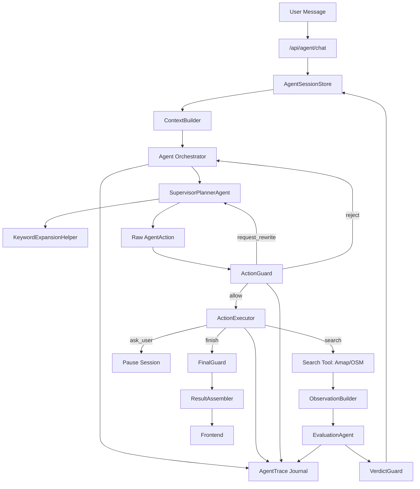

# Agent 优化技术方案

> **历史方案，仅作演进记录。** 文中的 planner 选 action 流程已被当前 workflow 的
> `policy.decideNextAction` 取代；单一 `SupervisorPlannerAgent` 和后续
> orchestrator-workers 都不是当前目标。当前依据见
> `docs/technical/current-agent-workflow.md`。

审计日期：2026-06-03  
适用范围：`app/api/agent/chat/route.ts`、`lib/agent/runtimeV3.ts`、`lib/agent/supervisorPlanner.ts`、`lib/agent/supervisor.ts`、`lib/agent/session.ts`、`lib/agent/guards.ts`、`lib/agent/finalGuard.ts`、`lib/agent/subagents/evaluationAgent.ts`、前端 Agent 状态展示链路。

## 1. 背景

当前 ChiSha Agent 已经从简单 LLM 解析演进为 Runtime V3：

- `SupervisorPlannerAgent` 维护用户目标与追问。
- `KeywordExpansionHelper` 生成搜索联想词。
- `SupervisorPlannerAgent` 选择下一步 action。
- `runtimeV3` 执行 loop、调用搜索工具、执行 guard。
- `EvaluationAgent` 验证候选语义相关性。
- `FinalGuard` 负责最终主推荐准入。

新的目标架构采用方案 A：收敛为单一 `SupervisorPlannerAgent`，由它同时维护 `UserGoal` 并输出下一步 `AgentAction`。`KeywordExpansionAgent` 降级为 `KeywordExpansionHelper`，只作为搜索词和 POI type 建议工具，不再作为独立主控 Agent。

落地顺序采用小步合并：先新增 `lib/agent/supervisorPlanner.ts` 作为 canonical 入口，把原 `supervisor.ts` 的 goal 维护能力和原 action planner 的决策能力并到同一个模块；Runtime 只通过 `runSupervisorPlanner` 获取 goal/action。此阶段不强求一次模型调用同时完成 goal 和 action，因为 `KeywordExpansionHelper` 仍需要夹在 goal 维护和 action 决策之间。

这个方向整体正确：模型负责理解和提出动作，Runtime 负责执行工具、预算、权限和最终兜底。但当前仍存在控制权分裂、会话恢复脆弱、上下文版本缺失、trace 不完整和授权粒度过粗等问题。

本方案目标是在不大幅改变产品体验的前提下，把当前 Agent 从“多模型流水线 + 手写兜底”收敛为“可审计、可恢复、上下文稳定的 Agent Orchestrator”。

## 2. 设计原则

1. Runtime 是执行器和安全边界，不是隐藏策略决策者。
2. Agent 输出可以被拒绝或要求重写，但不能被 Runtime 静默改写成另一种策略。
3. session 是一段可持续会话，不只是 pending question 的临时恢复 token。
4. 每个推荐结果必须能回放：模型原始动作、guard 决策、工具结果、候选验证、最终准入。
5. 候选验证必须绑定当前 goal 和 location 版本，避免旧候选被错误复用。
6. 放宽授权必须结构化，不能只用一个全局 `allowBroaden` 表达所有权限。
7. 继续保留 `EvaluationAgent` 作为语义验证核心，不新增 deterministic verifier fallback。

## 3. 明确非目标

### 3.1 不做 deterministic verifier fallback

本轮优化不引入“本地确定性语义验证器”来替代 `EvaluationAgent`。

原因：

1. 餐厅语义匹配涉及菜品、品类、别名、上下文偏好和数据源缺字段，简单本地规则容易产生假阳性。
2. 当前系统已经把主推荐准入放在 `FinalGuard`，再新增一个本地语义 fallback 会造成第三套验证口径。
3. 对用户而言，EvaluationAgent 不可用时更合理的行为是明确失败、追问或返回已验证缓存，而不是用低置信本地语义判断冒充验证。

允许做的替代优化：

- 对 `EvaluationAgent` 增加重试、超时、熔断和结构化错误返回。
- 支持“没有完成语义验证时暂停推荐并告知用户”。
- 允许返回候补，但必须标记为 `unverified`，且不能进入主推荐。
- 对完全相同的 goal、plan、restaurant batch 使用短期 evaluation cache。

禁止做的优化：

- 不允许在 EvaluationAgent 失败时用本地规则把候选标记为 `passed`。
- 不允许用餐厅名称、品类或 POI type 直接替代模型语义验证进入主推荐。
- 不允许把 `unverified` 候选通过 FinalGuard 作为主推荐返回。

### 3.2 不直接完全放开 Runtime

Runtime 仍然必须控制：

- 搜索调用预算。
- 工具调用权限。
- POI type 合法性。
- 搜索半径上限。
- 未授权放宽结果的主推荐准入。
- 未观察候选 id 的剔除。
- FinalGuard 主推荐准入。

### 3.3 不重写前端核心体验

本方案优先修复 Agent 架构和状态流。前端只补齐 Agent pause/question、trace 可视化和 sessionId 管理，不重做转盘、餐厅卡片或地图交互。

## 4. 当前问题与目标状态

| 问题 | 当前状态 | 目标状态 |
|---|---|---|
| 控制权分裂 | Supervisor、Action、Runtime Guard、FinalGuard 都在决策 | Orchestrator 负责 loop，SupervisorPlanner 负责策略，Guard 只做允许/拒绝/要求重写 |
| Guard 静默改写 | `finish` 可被改成 `search`，多关键词可被截断 | Guard 决策结构化，所有改写都转为 `request_rewrite` 或 runtime decision trace |
| Session 续跑弱 | 只有 pending question 才续跑 | 有效 sessionId 均可续跑，由 SupervisorPlanner 判断继续、patch 或新目标 |
| 缺少版本 | goal、candidate、location 没有版本关系 | goalVersion、locationSignature、verifiedAgainstGoalVersion 一致才可主推荐 |
| Trace 不完整 | SSE 有事件，但 session 缺少完整可回放 journal | 每轮 action、guard、tool、observation、state update 都持久化 |
| 授权粗糙 | `allowBroaden` 表达所有放宽授权 | 结构化 authorization scope |
| Evaluation 单点失败 | EvaluationAgent 失败导致整条链路失败 | 结构化失败、缓存、重试、暂停或只返回未验证候补 |
| 迁移残留 | `PlanningAgent`、旧 `tools.ts`、旧 action 入口仍在 | 主链路清晰，旧模块归档、删除或仅保留 deprecated 兼容 re-export |

## 5. 目标架构



## 6. 组件职责

| 组件 | 职责 | 不应承担 |
|---|---|---|
| API Route | 校验请求、加载 session、流式返回、保存最终状态 | 根据 pending question 决定是否续跑 |
| ContextBuilder | 从 session、request、preference 构建可信上下文 | 选择业务策略 |
| Agent Orchestrator | loop、预算、trace、状态提交、错误处理 | 语义推荐策略 |
| SupervisorPlannerAgent | 维护 goal、判断会话模式、输出下一步 action | 执行外部工具 |
| KeywordExpansionHelper | 生成搜索词和 POI type 建议 | 判断是否继续搜索或是否主推荐 |
| ActionGuard | 校验 action 合法性、权限、预算、结构 | 静默规划新 action |
| ActionExecutor | 执行 search / ask_user / finish | 改写模型策略 |
| Search Tool | 返回 POI 事实 | 判断主推荐资格 |
| EvaluationAgent | 语义验证与排序建议 | 绕过 FinalGuard |
| VerdictGuard | 清理模型 verdict 中不合法内容 | 生成语义 verdict fallback |
| FinalGuard | 主推荐最终准入 | 编造解释或修改事实 |
| AgentSessionStore | 持久化 session、trace、runtime state | 业务策略决策 |

## 7. Runtime 职责边界

Runtime 是当前架构中最容易膨胀的模块，因此需要单独定义边界。

### 7.1 合理职责

Runtime 合理职责包括：

1. 执行 Agent loop。
2. 从 request 和 session 构造上下文。
3. 调用 SupervisorPlanner、KeywordExpansionHelper、Evaluation 等模型子模块或 helper。
4. 调用 Amap/OSM 搜索工具。
5. 控制 action 次数、搜索次数、Evaluation batch、并发和超时。
6. 调用 ActionGuard、VerdictGuard 和 FinalGuard。
7. 写入 SSE event、runtime state 和 Agent trace。
8. 处理 pause、resume、finish。
9. 在预算耗尽、工具失败、模型失败时生成结构化 runtime decision。

这些职责合理的原因是：Runtime 相当于 Agent 的宿主环境。模型可以提出动作，但工具执行、权限、预算、状态提交和确定性安全边界必须由宿主负责。

### 7.2 越界职责

Runtime 不应承担：

1. 理解用户真实意图。
2. 维护 `UserGoal` 的语义分类。
3. 替 SupervisorPlanner 选择搜索策略。
4. 静默把模型 action 改写成另一种 action。
5. 静默把 `finish` 改成 `search`。
6. 静默把多关键词计划截断成单关键词计划。
7. 生成候选语义 verdict。
8. 把 `unverified` 或未授权候选提升为主推荐。
9. 在存储层或前端层补业务规则。

### 7.3 迁移目标

当前 `runtimeV3` 仍包含部分策略兜底，这是迁移期现实。目标不是完全删除 Runtime 保护，而是把“保护”和“策略”拆开：

```typescript
type RuntimeBoundary =
  | 'execute_action'
  | 'enforce_budget'
  | 'enforce_permission'
  | 'record_trace'
  | 'pause_or_finish';

type SupervisorPlannerBoundary =
  | 'choose_search_target'
  | 'decide_continue_or_finish'
  | 'ask_clarifying_question'
  | 'explain_strategy';
```

推荐处理方式：

1. 模型输出 raw action。
2. Runtime 调用 Guard 检查 action。
3. Guard 返回 `allow`、`reject` 或 `request_rewrite`。
4. `request_rewrite` 回到 SupervisorPlanner，而不是 Runtime 静默改写。
5. 如果 Runtime 必须强制结束、追问或报错，必须写入 `runtime_decision` trace。

验收标准：

- 任意 action 都能看到 raw action 和 guard decision。
- Runtime 不再无记录地替模型规划新搜索策略。
- Runtime 强制行为都有明确 trace 和原因。

## 8. 核心数据模型

### 8.1 AgentTraceItem

```typescript
export type AgentTraceType =
  | 'user_message'
  | 'model_goal'
  | 'model_action'
  | 'guard_decision'
  | 'tool_start'
  | 'tool_result'
  | 'observation'
  | 'evaluation'
  | 'state_update'
  | 'runtime_decision'
  | 'question'
  | 'final'
  | 'error';

export interface AgentTraceItem {
  id: string;
  sessionId: string;
  turnId: string;
  actionId?: string;
  type: AgentTraceType;
  createdAt: number;
  input?: unknown;
  output?: unknown;
  rawAction?: AgentAction;
  guardedAction?: AgentAction;
  guardDecision?: GuardrailDecision;
  error?: {
    code: string;
    message: string;
    retryable: boolean;
  };
}
```

要求：

- 所有模型原始输出必须记录。
- 所有 guard 结果必须记录。
- 所有工具调用必须有 start/result 成对 trace。
- 错误 trace 不包含 API key、完整请求头或隐私敏感字段。

### 8.2 GuardrailDecision

```typescript
export type GuardrailDecision =
  | {
      type: 'allow';
      action: AgentAction;
      notes?: string[];
    }
  | {
      type: 'reject';
      violations: GuardrailViolation[];
      fallback?: 'ask_user' | 'finish' | 'error';
    }
  | {
      type: 'request_rewrite';
      violations: GuardrailViolation[];
      instruction: string;
      suggestedAction?: AgentAction;
    };

export interface GuardrailViolation {
  code:
    | 'SEARCH_BUDGET_EXCEEDED'
    | 'INVALID_PLAN_SCHEMA'
    | 'MULTI_INTENT_KEYWORDS'
    | 'UNAUTHORIZED_BROADENING'
    | 'STRICT_DISTANCE_EXCEEDED'
    | 'DUPLICATE_PLAN'
    | 'UNOBSERVED_CANDIDATE_ID'
    | 'INVALID_POI_TYPE';
  message: string;
  severity: 'info' | 'warn' | 'error';
  details?: unknown;
}
```

设计要求：

- 多关键词计划不再静默截断，应返回 `request_rewrite`，要求模型拆成单关键词 action。
- 模型请求 `finish` 但仍需继续探索时，不再静默改成 `search`，应返回 `request_rewrite`，提示还有未尝试 target。
- 达到预算上限时可 `reject`，由 Orchestrator 生成 runtime decision trace 后结束或追问。
- Runtime 如果必须强制 fallback，必须记录 `runtime_decision`。

### 8.3 Versioned Goal

```typescript
export interface VersionedUserGoal {
  id: string;
  version: number;
  data: UserGoal;
  signature: string;
  createdAt: number;
  updatedAt: number;
  updatedByActionId?: string;
}
```

`signature` 应包含：

- primaryKeywords
- requestedItems
- acceptableCategories
- hardConstraints
- exclusions
- allowBroaden
- authorization scope 摘要

### 8.4 Versioned Candidate

```typescript
export interface VersionedRestaurantCandidate extends RestaurantCandidate {
  candidateId: string;
  goalId: string;
  verifiedAgainstGoalVersion: number;
  verifiedAgainstGoalSignature: string;
  locationSignature: string;
  evaluationTraceId?: string;
  stale?: boolean;
  staleReason?: string;
}
```

主推荐准入新增条件：

- `candidate.stale !== true`
- `candidate.verifiedAgainstGoalVersion === currentGoal.version`
- `candidate.verifiedAgainstGoalSignature === currentGoal.signature`
- `candidate.locationSignature === currentLocationSignature`

### 8.5 Authorization Scope

```typescript
export type AuthorizationScopeKind =
  | 'distance_expansion'
  | 'category_broaden'
  | 'fallback_primary'
  | 'unverified_backup_only';

export interface AgentAuthorization {
  id: string;
  kind: AuthorizationScopeKind;
  createdAt: number;
  sourceQuestionId?: string;
  reason: string;
  constraints?: {
    maxMeters?: number;
    allowedSearchIntents?: SearchIntent[];
    allowedKeywords?: string[];
  };
}
```

`UserGoal.allowBroaden` 可短期保留兼容，但新增逻辑应优先读取 `authorizations`。

## 9. 分阶段实施计划

### Phase 1：Trace 与 Guard 决策结构化

目标：先让每次推荐可解释，不改变最终用户体验。

改动文件：

- `lib/agent/types.ts`
- `lib/agent/runtimeV3.ts`
- `lib/agent/guards.ts`
- `lib/agent/session.ts`
- `lib/agent/d1SessionSchema.ts`
- `lib/agent/d1SessionStore.ts`
- `app/api/agent/chat/route.ts`

任务：

1. 增加 `AgentTraceItem`、`GuardrailDecision`、`GuardrailViolation` 类型。
2. session 增加 `trace: AgentTraceItem[]`。
3. D1 schema 增加 `trace_json` 字段；如果暂不迁移字段，可先放入 `runtime_state_json.trace`。
4. `guardAction` 返回 `GuardrailDecision`，不直接返回改写后的 action。
5. Orchestrator 负责处理 `request_rewrite`，最多允许 1 次模型重写。
6. 所有 runtime 强制行为记录为 `runtime_decision`。
7. SSE 继续发原有事件，同时补充 trace id，前端可暂不展示。

验收：

- 任意推荐结果可以在 session 中看到完整 action timeline。
- 可以区分模型原始 action、guard 拦截、runtime 强制结束和 FinalGuard 过滤。
- 现有推荐结果数量和排序不出现明显回归。

### Phase 2：Goal/Candidate 版本与失效策略

目标：用户多轮修改需求后，旧候选不会未经重验进入主推荐。

改动文件：

- `lib/agent/types.ts`
- `lib/agent/supervisorPlanner.ts`
- `lib/agent/runtimeV3.ts`
- `lib/agent/evaluator.ts`
- `lib/agent/finalGuard.ts`
- `lib/agent/resultAssembler.ts`
- `lib/agent/session.ts`

任务：

1. 为 goal 增加 `goalId`、`goalVersion`、`goalSignature`。
2. `applyGoalPatch` 每次改变目标或约束时递增 version。
3. 为 candidate 增加 `verifiedAgainstGoalVersion` 和 `verifiedAgainstGoalSignature`。
4. 增加 `deriveContextInvalidationPlan(previousGoal, nextGoal, previousLocation, nextLocation)`。
5. hardConstraints、exclusions、primary target、location 改变时，将旧 candidates 标记 stale。
6. FinalGuard 拒绝 stale 或版本不匹配的 candidate。
7. ResultAssembler 将 stale 说明写入 unmetConstraints 或 recommendationWarnings。

验收：

- “先搜牛排，再加预算 50 以下”不会复用未重验的牛排候选作为主推荐。
- “换个位置重新推荐”不会复用旧位置候选。
- “允许放宽”只影响授权 scope 覆盖的候选。

### Phase 3：Session 续跑正常化

目标：sessionId 表达一段对话，而不是只表达 pending question。

改动文件：

- `app/api/agent/chat/route.ts`
- `lib/agent/supervisorPlanner.ts`
- `lib/agent/schemas/clarification.ts`
- `lib/agent/types.ts`
- `hooks/useRestaurantSearch.ts`
- `context/AppReducer.ts`
- `context/AppContext.tsx`

任务：

1. route 层只要收到有效 sessionId 就加载旧 session。
2. Supervisor 输出 `conversationMode`：
   - `continue_current_goal`
   - `patch_current_goal`
   - `start_new_goal`
3. pending question 的 option effect 处理下沉到 runtime/supervisor，不在 route 层特殊 patch。
4. 前端 AppState 增加：
   - `agentSessionId`
   - `agentQuestion`
   - `agentTrace`
   - `step: 'AGENT_QUESTION'`
5. 用户普通 follow-up 也带 sessionId。
6. 当 Supervisor 判定 `start_new_goal` 时，保留旧 session trace，但创建新 goal version 或新 session turn。

验收：

- “刚才这些里有没有便宜点的？”能基于旧候选和旧 goal patch。
- “不要辣，重新推荐”能加约束并使旧候选失效。
- “换成日料”能替换 primary target 并清理旧搜索状态。
- 已完成 session 再发送完全新需求时，可以正确 start new goal。

### Phase 4：EvaluationAgent 稳定性治理

目标：不做 deterministic verifier fallback，但避免 EvaluationAgent 失败直接造成不可解释的体验。

改动文件：

- `lib/agent/subagents/evaluationAgent.ts`
- `lib/agent/runtimeV3.ts`
- `lib/agent/modelClient.ts`
- `lib/agent/guards.ts`
- `lib/agent/types.ts`

任务：

1. 将 EvaluationAgent 调用统一接入 `callJsonFunctionAgent`，复用解析、截断重试和错误结构。
2. 增加 evaluation cache key：
   - model
   - goalSignature
   - plan key
   - restaurant ids
   - restaurant fact hash
3. cache 命中时记录 `evaluation` trace，标记 `source: cache`。
4. EvaluationAgent 失败时返回结构化错误给 Orchestrator。
5. Orchestrator 根据错误类型选择：
   - retry
   - pause and ask user
   - return no primary result with explanation
   - keep unverified candidates as backup only
6. 修复 `existingCandidates`：要么传入压缩摘要，要么删除参数。
7. VerdictGuard 继续防止模型选择未观察 id、硬约束失败 id、未授权放宽 id。

明确限制：

- 失败时不生成本地 `passed` verdict。
- 失败时不让 unverified candidate 进入主推荐。
- 失败时允许展示候补，但 UI 必须标记“未完成语义验证”。

验收：

- EvaluationAgent 429 时不会静默推荐未经验证的主结果。
- EvaluationAgent parse error 有 trace 和用户可理解错误。
- 相同输入重复调用能命中 cache，降低成本。

### Phase 5：授权 Scope 化

目标：把 `allowBroaden` 从全局开关升级为可解释的授权记录。

改动文件：

- `lib/agent/types.ts`
- `lib/agent/supervisorPlanner.ts`
- `lib/agent/schemas/goal.ts`
- `lib/agent/schemas/clarification.ts`
- `lib/agent/broadenAdmission.ts`
- `lib/agent/finalGuard.ts`
- `lib/agent/runtimeV3.ts`

任务：

1. 增加 `AgentAuthorization` 类型。
2. `ClarificationEffect` 支持写入 authorization。
3. “扩大范围”写入 `distance_expansion`，带 `maxMeters`。
4. “允许放宽”写入 `category_broaden` 或 `fallback_primary`，由 pending question 的上下文决定。
5. FinalGuard 根据 authorization scope 判断候选是否可进入主推荐。
6. 逐步保留 `allowBroaden` 兼容旧 session，但新逻辑以 authorization 为准。

验收：

- 用户只授权“扩大距离”时，不会自动授权所有 fallback 品类进主推荐。
- 用户只授权“候补看看”时，候选不能进入主推荐。
- 推荐解释能说明放宽来自哪次授权。

### Phase 6：清理迁移残留与模型接口现代化

目标：减少维护成本，降低指令层级和 prompt injection 风险。

改动文件：

- `lib/agent/modelClient.ts`
- `lib/agent/subagents/evaluationAgent.ts`
- `lib/agent/subagents/planningAgent.ts`
- `lib/agent/tools.ts`
- `lib/agent/types.ts`
- `__tests__/lib/agent/*`

任务：

1. `modelClient` 改为 system/user 分离。
2. 输入结构区分：
   - `trustedContext`
   - `userMessage`
   - `toolObservations`
   - `policy`
3. 所有外部工具结果标记为 untrusted observation。
4. 删除或归档 deprecated `PlanningAgent` 主链路引用。
5. `tools.ts` 如果只保留迁移参考，移动到 `docs/legacy` 或添加更明显注释。
6. 所有模型调用统一通过同一个 client wrapper。

验收：

- Supervisor、Action、KeywordExpansion、Evaluation 的调用结构一致。
- 维护者能一眼判断主链路文件。
- 模型输入中用户文本和系统策略边界清晰。

## 10. 测试计划

### 9.1 单元测试

新增或更新：

- `guardAction` 返回 `GuardrailDecision`。
- `request_rewrite` 最多重试一次。
- `goalVersion` 在目标或硬约束变化时递增。
- `candidate.verifiedAgainstGoalVersion` 不匹配时 FinalGuard 拒绝。
- `locationSignature` 变化时候选 stale。
- authorization scope 控制主推荐准入。
- EvaluationAgent 失败不会产生本地 `passed` verdict。

### 9.2 集成测试

覆盖场景：

1. `想吃牛排` -> 返回主推荐。
2. 继续 `预算 50 以下` -> 旧候选 stale 或重验。
3. 继续 `换成日料` -> primary target 替换，旧搜索状态清理。
4. `想吃健康点` -> 追问。
5. 回复 `都行` -> 开放探索。
6. 严格 500m 无结果 -> 追问是否扩大。
7. 回复 `扩大范围` -> 只授权距离扩大。
8. EvaluationAgent 429 -> 不返回未经验证主推荐。
9. 已完成 session 继续问 `刚才这些里便宜点的` -> patch 当前 goal。
10. 已完成 session 输入完全新需求 `想吃火锅` -> start new goal。

### 9.3 Golden Trace Eval

建立 `__tests__/fixtures/agent-traces/`：

- 每个 fixture 包含 user turns、mock search results、expected trace outline、expected final constraints。
- 不要求模型输出完全一致，但要求关键决策满足断言。

建议首批 20 个场景：

- 明确菜品
- 菜系
- 多目标
- 排除项
- 不吃辣
- 严格距离
- 预算
- 营业中
- 开放推荐
- 软偏好需要追问
- 允许放宽
- 拒绝放宽
- 换目标
- 追加约束
- 位置变化
- Evaluation 失败
- Amap 失败 OSM fallback
- 重复计划
- 多关键词拆分
- 未观察 id 被剔除

## 11. 数据迁移

### 11.1 D1 schema

建议新增迁移：

```sql
ALTER TABLE agent_sessions ADD COLUMN trace_json TEXT NOT NULL DEFAULT '[]';
ALTER TABLE agent_sessions ADD COLUMN goal_version INTEGER NOT NULL DEFAULT 1;
```

如果 Cloudflare D1 对现有列变更有兼容风险，可先把新增字段写入 `runtime_state_json`，后续再拆列。

### 11.2 旧 session 兼容

读取旧 session 时：

- 缺少 trace 时默认 `[]`。
- 缺少 goal version 时默认 `1`。
- 缺少 candidate version 时默认 stale，或按当前 goal signature 重新验证。
- 缺少 authorization 时根据 `allowBroaden` 生成兼容授权，但 trace 标记为 `legacy_allowBroaden`。

## 12. 风险与缓解

| 风险 | 影响 | 缓解 |
|---|---|---|
| Trace 增加 session 体积 | D1 写入变大 | trace 做摘要，完整 tool result 不落库，只存 summary |
| Guard 不再静默改写后模型重写失败 | 结果可能更慢 | 最多重写一次，失败后 runtime decision 追问或结束 |
| goalVersion 使候选更多 stale | 搜索成本上升 | 加 evaluation cache 和搜索结果复用 |
| session 续跑扩大后用户误复用旧上下文 | 推荐错上下文 | Supervisor 增加 `start_new_goal`，UI 提供“新搜索”入口 |
| authorization scope 迁移复杂 | 老 session 行为不一致 | 保留 `allowBroaden` 兼容层，逐步迁移 |
| EvaluationAgent 不做 fallback | 模型失败时无主推荐 | 明确暂停、错误提示、cache 和重试，不冒充验证 |

## 13. 推荐落地顺序

最小可落地切入点：

1. 增加 trace，但先不改变业务行为。
2. 增加 goal/candidate signature，FinalGuard 拒绝明显 stale 候选。
3. 修改 route，只要 sessionId 有效就续跑，Supervisor 判定会话模式。
4. EvaluationAgent 失败结构化，不做 deterministic verifier fallback。
5. `allowBroaden` 兼容保留，同时引入 authorization scope。

## 14. 验收标准

整体完成后，应满足：

1. 任意一次推荐都能解释完整决策链。
2. 普通 follow-up 能复用上下文。
3. 用户新增硬约束后，旧候选不会未经重验进入主推荐。
4. 允许放宽的范围可解释、可追踪、可限制。
5. EvaluationAgent 不可用时不会返回伪验证主推荐。
6. 旧 deprecated Agent 文件不会误导主链路维护。
7. 现有核心场景测试通过，新增 golden trace eval 覆盖多轮和失败场景。

## 15. 与既有文档关系

本方案是在 `docs/agent-architecture-review.md` 的问题诊断基础上形成的落地版技术方案。

差异点：

- 本文明确“不做 deterministic verifier fallback”。
- 本文细化了 trace、版本、authorization、session 续跑和 EvaluationAgent 失败处理的接口设计。
- 本文按 Phase 拆分了具体改造任务和验收标准。
