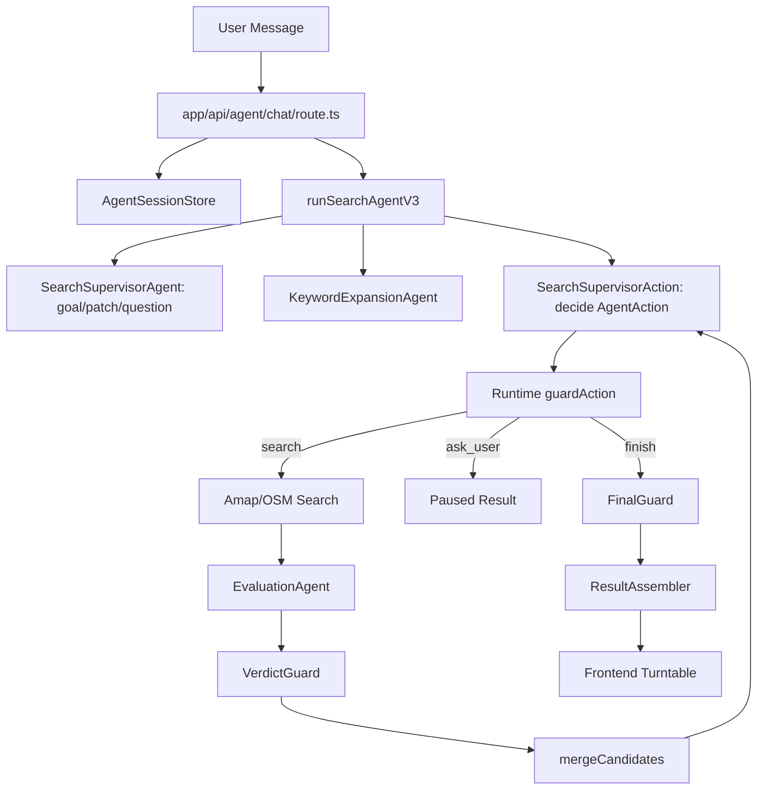

# Agent Architecture Review

> ⚠️ **已过期，仅作演进记录。** 本文描述的 Agent 架构已被后续两轮改造取代：
> 当前形态见 `docs/agent-loop-shape-review-2026-08.md` 与
> `docs/Agent-Loop-形态重构技术方案-2026-08.md`。
> 文中的 supervisorAction.ts 等文件已不存在。

> 基于当前代码的 Agent 架构审计与问题分析。本文重点回答：现有 Agent 为什么难以自主决策、上下文管理为什么脆弱、哪些 runtime 硬约束已经越界，以及下一步应如何治理。

审计日期：2026-05-29  
审计范围：`app/api/agent/chat/route.ts`、`lib/agent/runtimeV3.ts`、`lib/agent/supervisor.ts`、`lib/agent/supervisorAction.ts`、`lib/agent/session.ts`、`lib/agent/guards.ts`、`lib/agent/finalGuard.ts`、`hooks/useRestaurantSearch.ts`

---

## 1. 结论摘要

当前实现不是一个控制权清晰的 Agent 系统，而是一个“LLM 子任务 + 手写 runtime loop + 多层 guardrail”的混合系统。

核心问题不是模型能力不够，而是架构边界不清：

1. `SearchSupervisorAgent` 被描述为主 Agent，但真实控制权分散在 `runtimeV3`、`supervisorAction`、`guardAction`、`FinalGuard` 和前端状态机中。
2. runtime 的 guardrail 不只做安全校验，还在改写计划、强制继续搜索、强制结束或强制追问，实际替 Agent 做策略决策。
3. session 保存的是一组运行快照，没有 goal version、candidate version、上下文摘要、候选失效机制，导致多轮更新后旧候选和旧验证结果可能继续被使用。
4. 多轮会话只围绕 `pendingQuestion` 续跑，普通 follow-up 不能稳定复用上下文。
5. 前端全局状态机没有 Agent pause/question 态，会话暂停只存在 hook 本地状态中。

一句话概括：当前系统让 Agent 负责解释，让 runtime 负责决策。这会导致行为难调试、难扩展，也会让 Agent 看起来“不自主”。

---

## 2. 当前主链路

当前 `/api/agent/chat` 主链路如下：



关键入口：

- `app/api/agent/chat/route.ts`：SSE API、session 加载和保存、Amap/OSM 工具执行。
- `lib/agent/runtimeV3.ts`：主 loop、上下文构造、action guard、搜索执行、结束和暂停。
- `lib/agent/supervisor.ts`：理解用户目标，维护 `UserGoal` 或 `GoalPatch`。
- `lib/agent/supervisorAction.ts`：决定下一步 `AgentAction`，但不是唯一控制器。
- `lib/agent/session.ts`：会话状态持久化抽象。
- `lib/agent/guards.ts` 与 `lib/agent/finalGuard.ts`：候选过滤、主推荐准入。

---

## 3. 主要问题

### 3.1 控制权分裂

`SearchSupervisorAgent` 和 `supervisorAction` 的 prompt 都表达了“主控”语义，但真实执行时，runtime 仍会改写或覆盖 action。

典型位置：

- `lib/agent/runtimeV3.ts:115`：runtime 自己维护 while loop。
- `lib/agent/supervisorAction.ts:41`：action prompt 声称自己是唯一 loop controller。
- `lib/agent/runtimeV3.ts:433`：`guardAction` 对模型 action 做二次决策。
- `lib/agent/runtimeV3.ts:560`：模型请求 finish 时，runtime 可能强制改成继续 search。
- `lib/agent/finalGuard.ts:13`：最终主推荐准入再次覆盖模型选择。

影响：

- Agent 的输出不是最终决策，只是 runtime 的输入建议。
- 调试时很难判断结果来自模型意图、deterministic fallback、guard 改写还是 FinalGuard。
- prompt 中的“自主决策”承诺与实现不一致，后续继续优化 prompt 收益有限。

### 3.2 Guardrail 越界为策略决策

当前 guardrail 同时承担三类职责：

1. 安全与结构校验：例如 schema 校验、半径限制、未观察候选 id 移除。
2. 业务准入：例如未授权 broadened/fallback 不能进主推荐。
3. 策略决策：例如拆关键词、强制继续搜索联想词、达到上限后强制结束或追问。

其中第 3 类已经越界。

典型位置：

- `lib/agent/runtimeV3.ts:481`：多关键词 action 被强制截成单关键词。
- `lib/agent/runtimeV3.ts:505`：runtime 重建 `SearchPlan`，清空并重新选择 `poiType`。
- `lib/agent/runtimeV3.ts:538`：重复计划直接触发 finish 或 ask_user。
- `lib/agent/runtimeV3.ts:564`：finish 前强制补搜 related/broadened keyword。
- `lib/agent/runtimeV3.ts:165`：搜索上限触发 runtime 强制 finish 或 ask_user。

影响：

- 模型无法根据上下文决定“是否值得继续探索”。
- guardrail 日志只能说明被改写，但无法表达完整策略原因。
- 新策略需要改 runtime 代码，而不是调整 Agent 能力。

建议边界：

- Guardrail 可以 `reject` 或 `request_rewrite`。
- Guardrail 不应静默把 `finish` 改成 `search`，也不应静默把多关键词计划改成单关键词计划。
- 所有 action 改写必须记录 `rawAction`、`guardedAction`、`violation`、`decisionReason`。

### 3.3 Agent 设计更像多模型流水线，不像统一 Agent Loop

当前链路包含多个模型角色：

- `SearchSupervisorAgent`：理解目标。
- `KeywordExpansionAgent`：生成联想词。
- `SearchSupervisorAction`：选择下一步 action。
- `EvaluationAgent`：验证候选。

问题不在“多 Agent”，而在它们共享的状态和权限不清晰：

- Supervisor 输出 goal，但 action controller 又要基于 goal 决策。
- KeywordExpansion 会预生成 related/broadened targets，runtime 又会强制消费这些 targets。
- EvaluationAgent 负责语义验证，但 FinalGuard 再次决定主推荐准入。
- `PlanningAgent` 和旧 `tools.ts` 仍在代码中，但不在主链路中，形成迁移残留。

影响：

- 每个 Agent 都只能看到部分上下文。
- 上下文解释和策略选择被切碎。
- 成本更高，失败点更多。
- 系统很难形成稳定、可解释的“思考-行动-观察-再决策”循环。

### 3.4 上下文管理缺少版本和失效机制

session 当前保存：

```typescript
interface AgentRuntimeState {
  goal?: UserGoal;
  attempts: SearchAttempt[];
  candidates: RestaurantCandidate[];
  actions?: AgentActionRecord[];
  observations?: AgentObservation[];
  pendingQuestion?: PendingQuestion;
}
```

这能恢复运行快照，但不是可靠 memory。

主要缺口：

1. 没有 `goalVersion`。用户新增预算、距离、排除项后，旧候选不一定重新验证。
2. 没有 `candidateVerifiedAgainstGoalVersion`。无法判断候选是否基于当前 goal 验证。
3. 没有 `contextSummary`。长会话只能靠 `messages.slice(-8)` 和结构化状态，语义上下文可能丢失。
4. 没有 session 级 action replay。保存了 action 和 observation，但状态恢复直接读快照，不校验快照与日志一致性。
5. 没有 location 变化处理。session 保存 location，但 route 每次请求使用 request location，缺少位置变化后的候选失效策略。

典型位置：

- `lib/agent/session.ts:147`：直接把 runtime state 覆盖到 session。
- `lib/agent/runtimeV3.ts:334`：初始化 context 时直接继承 previous attempts/candidates。
- `lib/agent/runtimeV3.ts:411`：只在 pending question 且 primary target signature 改变时 reset search state。

风险示例：

- 用户第一轮搜“牛排”，第二轮补充“预算 50 以下”，如果主目标没变，旧牛排候选可能保留。
- 用户第一轮严格 500m，第二轮换位置，旧 candidates 没有明确失效。
- 用户从“日料”追问到“换成韩餐”，只有 primary target 变化才 reset，软硬约束变化不一定触发候选重新验证。

### 3.5 多轮会话只服务 pending question

`/api/agent/chat` 的续跑条件是：

```typescript
const shouldResumeSession = Boolean(resumableSession?.pendingQuestion);
```

这意味着：

- 有 `pendingQuestion` 时，用户回复会续跑旧 session。
- 没有 `pendingQuestion` 时，即使传了 `sessionId`，也会新建 session。

影响：

- “刚才这些里有没有便宜点的？”
- “换成日料，但还在附近”
- “不要辣，重新推荐”
- “把候补也考虑进去”

这些自然 follow-up 无法稳定进入旧上下文，只能被当成新查询。

建议：

- sessionId 应代表一段 Agent conversation，而不是只代表一次 pending question。
- 是否复用上下文应由 Supervisor 判断：`continue_current_goal`、`patch_goal`、`start_new_goal`。
- route 层不应根据 `pendingQuestion` 决定是否续跑。

### 3.6 前端状态机不包含 Agent pause/question

全局 App 状态流仍是：

```text
INPUT -> UNDERSTANDING -> SEARCHING -> READY -> SPINNING -> RESULT
```

Agent 追问只保存在 `useRestaurantSearch` 的本地 `progress.question` 中。

典型位置：

- `context/AppReducer.ts:7`：无 `QUESTION` 或 `PAUSED` 状态。
- `hooks/useRestaurantSearch.ts:271`：收到 paused question 后直接 return，没有写入全局状态。

影响：

- 组件卸载、页面切换或 hook 重建后，pending question 容易丢。
- UI 无法统一表达“Agent 暂停等待用户输入”。
- 后续要做 ChatPanel 或多轮会话时，需要重改状态模型。

建议：

```typescript
type AppStep =
  | 'INPUT'
  | 'UNDERSTANDING'
  | 'SEARCHING'
  | 'AGENT_QUESTION'
  | 'READY'
  | 'SPINNING'
  | 'RESULT'
  | 'ERROR';
```

同时在 AppState 中加入：

```typescript
agentSessionId?: string;
agentQuestion?: AgentQuestion;
agentTrace?: AgentTraceEvent[];
```

### 3.7 EvaluationAgent 没有真正利用已有候选

runtime 调用 `runEvaluationAgent` 时传入了 `existingCandidates`，但 `evaluationAgent.ts` 构造模型输入时没有包含它。

影响：

- EvaluationAgent 不能基于已有候选做跨轮比较。
- 去重、补充验证、候选池排序主要靠 runtime merge 和 FinalGuard。
- 模型无法理解“上一轮已经有这些候选，本轮只需要补足或替换”。

建议：

- 要么把 `existingCandidates` 放入模型输入的压缩摘要。
- 要么删除该参数，明确 EvaluationAgent 只评估当前批次，跨轮排序交给 deterministic ranker。

### 3.8 模型调用接口削弱了指令层级

`callJsonFunctionAgent` 把 system prompt 和 JSON input 拼成一个 user message：

```typescript
messages: [
  {
    role: 'user',
    content: `${systemPrompt}\n\n${JSON.stringify(input)}`,
  },
]
```

影响：

- 指令层级不清晰。
- 不利于后续使用现代 structured outputs。
- prompt 注入防护弱于标准 system/user 分离。

建议：

- 改成 system/user 分离。
- 新模型使用 structured output JSON schema 或 tool calling。
- 输入中区分 `trusted_context`、`user_message`、`tool_observations`。

---

## 4. 根因分析

### 4.1 架构目标摇摆

系统既想要：

- 确定性、可控、不会乱推荐；
- 又想要 Agent 自主规划、动态决策。

但当前做法是把大量策略塞进 runtime guard，导致两边都没有完全实现：

- 可控性来自硬编码，难解释、难扩展。
- 自主性被 runtime 持续削弱。

### 4.2 缺少一等的 Agent Trace

当前 SSE 有 `action`、`observation`、`guardrail`，但 session 中没有一个完整可审计的 trace model。

理想 trace 应包含：

```typescript
interface AgentTraceItem {
  id: string;
  turnId: string;
  type: 'model_action' | 'guardrail' | 'tool_call' | 'tool_result' | 'state_update' | 'final';
  input?: unknown;
  output?: unknown;
  rawAction?: AgentAction;
  guardedAction?: AgentAction;
  violation?: GuardrailViolation[];
  createdAt: number;
}
```

没有 trace，问题只能从最终结果反推。

### 4.3 Goal、Plan、Candidate 缺少版本关系

当前 `UserGoal`、`SearchPlan`、`RestaurantCandidate` 是松散关联。

更合理的关系：

```typescript
interface VersionedGoal {
  id: string;
  version: number;
  data: UserGoal;
  createdByActionId: string;
}

interface RestaurantCandidate {
  restaurant: Restaurant;
  sourceAttempt: number;
  verifiedAgainstGoalVersion: number;
  verification: CandidateVerification;
}
```

这样才能在 goal 更新后明确知道哪些候选可复用、哪些需要重验、哪些必须失效。

---

## 5. 改造原则

### 5.1 Runtime 不应静默改写策略

允许：

- schema 校验失败后拒绝 action。
- 硬约束违反后拒绝 action。
- search budget 耗尽后拒绝 action。
- 要求 Agent 重新输出 action。

不建议：

- 把 `finish` 改成 `search`。
- 把多关键词 plan 改成单关键词 plan。
- 把 broad/fallback 结果自动提升为主推荐。
- 在 runtime 中写死“必须搜完 relatedKeywords”。

### 5.2 Guardrail 输出必须结构化

建议：

```typescript
type GuardrailDecision =
  | { type: 'allow'; action: AgentAction }
  | { type: 'reject'; violations: GuardrailViolation[] }
  | { type: 'request_rewrite'; violations: GuardrailViolation[]; instruction: string };
```

这样 Agent loop 可以继续让模型重写，而不是 runtime 自己接管。

### 5.3 主推荐准入集中在 FinalGuard

`EvaluationAgent` 可以判断语义匹配，但不能最终决定主推荐。

最终准入只看：

- 确定性硬约束是否通过。
- `verification.status === 'passed'`。
- `primaryEligible === true`。
- 是否基于当前 goal version 验证。
- 是否得到用户授权放宽。

### 5.4 多轮上下文由 SessionStore 统一管理

route 层职责应缩小为：

- 校验请求。
- 加载 session。
- 调用 runtime。
- 流式返回 event。

不应在 route 层特殊处理 pending question 的 goal patch。

---

## 6. 推荐目标架构

```mermaid
graph TB
    U[User Message] --> API[/api/agent/chat]
    API --> STORE[SessionStore]
    STORE --> CTX[ContextBuilder]
    CTX --> ORCH[Agent Orchestrator]

    ORCH --> SUP[Supervisor / Planner]
    SUP --> DEC{AgentAction}

    DEC -- search --> AG[ActionGuard]
    AG -- allow --> TOOL[Search Tool]
    TOOL --> OBS[ObservationBuilder]
    OBS --> VERIFY[CandidateVerifier]
    VERIFY --> STORE
    STORE --> ORCH

    DEC -- ask_user --> Q[Pause Session]
    DEC -- finish --> FG[FinalGuard]
    FG --> ASM[ResultAssembler]
```

### 6.1 组件职责

| 组件 | 职责 | 不应承担 |
|---|---|---|
| Agent Orchestrator | loop、预算、事件、状态提交 | 语义策略 |
| Supervisor / Planner | 维护目标、选择 action、解释策略 | 执行外部工具 |
| ActionGuard | 校验 action 是否允许执行 | 静默替 Agent 规划 |
| Search Tool | 返回 POI 事实 | 判断主推荐 |
| CandidateVerifier | 语义匹配和证据归因 | 绕过硬约束 |
| FinalGuard | 主推荐准入 | 编造理由 |
| SessionStore | 可信状态和 trace | 业务决策 |
| Frontend State | 展示搜索、暂停、结果 | 推断 Agent 内部状态 |

---

## 7. 分阶段改造计划

### Phase 1：收敛控制权和 trace

目标：不大改产品体验，先让决策链可解释。

任务：

1. 引入 `AgentTraceItem`，保存 raw action、guard decision、tool result、final result。
2. `guardAction` 改为返回 `GuardrailDecision`，不再静默替换 action。
3. `guardFinishAction` 不再强制继续搜，改为 `request_rewrite` 或把建议返回给 Supervisor。
4. `runtimeV3` 中所有 fallback finish/ask_user 都记录为 runtime decision。
5. 前端展示 debug trace 可先隐藏在开发模式。

验收：

- 任意一次推荐都能解释：模型原始决策是什么、runtime 是否拦截、为什么拦截、最终结果来自哪里。

### Phase 2：修复上下文版本和候选失效

目标：多轮更新后不会复用错误候选。

任务：

1. 给 `UserGoal` 加 `goalId` 和 `goalVersion`。
2. 给 `RestaurantCandidate` 加 `verifiedAgainstGoalVersion`。
3. goal 的 hard constraints、primary targets、location 改变时，旧候选标记 stale 或重新验证。
4. `shouldResetSearchStateAfterGoalUpdate` 扩展为 `deriveContextInvalidationPlan`。
5. EvaluationAgent 输入明确包含当前批次和可选 existing candidate summary。

验收：

- 用户追加预算、距离、排除项后，旧候选不会未经重验进入主推荐。

### Phase 3：多轮会话正常化

目标：sessionId 支持普通 follow-up，而不是只支持 pending question。

任务：

1. route 层只要传入有效 sessionId 就加载旧 session。
2. Supervisor 输出 `conversationMode`：`continue_current_goal`、`patch_goal`、`start_new_goal`。
3. pending question 的 option effect 处理从 route 下沉到 runtime/supervisor。
4. 前端 AppState 增加 `AGENT_QUESTION`、`agentSessionId`、`agentQuestion`。

验收：

- “刚才这些里换便宜点”、“不要辣重新推荐”、“改成日料”能复用上下文并正确更新 goal。

### Phase 4：简化多 Agent 编排

目标：减少重复理解和迁移残留。

建议二选一：

方案 A：单 Supervisor 主控

- Supervisor 同时负责 goal update 和 action planning。
- Keyword expansion 变成 deterministic helper 或 Supervisor 内部输出。
- EvaluationAgent 只做 candidate verification。

方案 B：明确多 Agent 分工

- IntentAgent：只维护 goal。
- PlannerAgent：只生成计划。
- VerifierAgent：只验证候选。
- Orchestrator：唯一 loop controller。

无论选哪种，都应删除或归档未使用的 `PlanningAgent` 和旧 `tools.ts`，避免维护者误判主链路。

### Phase 5：模型接口现代化

目标：降低结构化输出失败和 prompt 注入风险。

任务：

1. system/user message 分离。
2. 使用 structured outputs 或现代 tool calling。
3. 输入分区：`trusted_context`、`user_message`、`tool_observations`、`policy`。
4. 统一模型调用 wrapper，避免 `evaluationAgent` 和 `modelClient` 各写一套解析逻辑。

---

## 8. 风险与取舍

### 8.1 不建议直接完全放开 runtime

餐厅推荐涉及距离、营业状态、排除项、预算等事实约束。完全让模型自由规划，会提高幻觉和错误推荐风险。

正确方向不是去掉 guard，而是让 guard 可解释、可审计，并把 guard 限制在边界控制。

### 8.2 不建议继续堆 prompt

当前问题主要来自架构职责不清。继续给 Supervisor prompt 添加规则，会带来：

- prompt 更长。
- schema 更复杂。
- 模型更容易截断或输出无效结构。
- runtime 仍然会覆盖模型决策。

### 8.3 不建议同时保留两套 Agent 架构

已有文档和代码中还存在旧 Workflow、PlanningAgent、AI SDK tools 的痕迹。继续并行会导致：

- 测试覆盖方向混乱。
- 新人无法判断主链路。
- bug 修复落在错误层。

---

## 9. 优先级清单

P0：

- 为 action guard 增加结构化 trace。
- 禁止 runtime 静默把 `finish` 改成 `search`。
- 给候选加 goal version 或在 goal 更新后强制重验候选。
- sessionId 支持普通 follow-up。

P1：

- 前端增加 `AGENT_QUESTION` 状态。
- route 层移除 pending question 的特殊 patch 逻辑。
- EvaluationAgent 输入补齐 existing candidates 或删除该参数。
- 清理未使用 Agent 文件和旧文档描述。

P2：

- 模型接口升级为 system/user 分离和 structured outputs。
- 建立 Agent trace 可视化。
- 引入 context summary，减少长会话状态膨胀。

---

## 10. 推荐的最小落地切入点

如果只做一轮小改，建议从这三件事开始：

1. 在 `runtimeV3` 中记录 `rawAction`、`guardedAction`、`guardrailDecision`，先不改业务行为。
2. 给 `RestaurantCandidate` 增加 `verifiedAgainstGoalSignature`，goal 更新时过滤不匹配候选。
3. 修改 `/api/agent/chat`：只要 sessionId 有效就续跑，由 Supervisor 判断是 patch 旧 goal 还是 start new goal。

这三项可以明显提升可调试性和多轮正确性，同时不会大幅影响现有 UI 和推荐流程。

