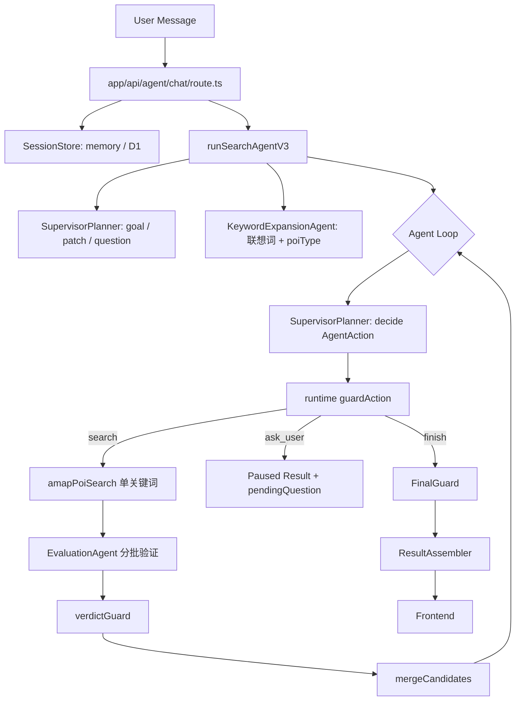

> 状态：历史归档。仅用于追溯，不是当前实现依据。

# Agent Harness 架构评审（2026-08）

> 对照业界 Agent Harness 最佳实践，审计当前 `lib/agent/**` 主链路，给出问题清单与优化优先级。
> 本文取代 `docs/agent-architecture-review.md`（2026-05-29）——那份审计的 P0 项已基本落地，结论已过期。
> **后续**：本文的 P0/P1 已落地（`44c5dbf`…`f9060f1`）。下一轮针对 **loop 形态**（模型与代码的分工位置）的评审见
> `docs/agent-loop-shape-review-2026-08.md`，配套方案 `docs/Agent-Loop-形态重构技术方案-2026-08.md`。

审计日期：2026-08-12
审计范围：`app/api/agent/chat/route.ts`、`app/api/agent/search/route.ts`、`app/api/agent/session/[id]/route.ts`、`lib/agent/runtimeV3.ts`、`lib/agent/supervisor.ts`、`lib/agent/supervisorPlanner.ts`、`lib/agent/modelClient.ts`、`lib/agent/guards.ts`、`lib/agent/finalGuard.ts`、`lib/agent/evaluator.ts`、`lib/agent/session.ts`、`lib/agent/d1SessionStore.ts`、`lib/agent/subagents/**`、`lib/agent/schemas/**`、`lib/api.ts`、`lib/logger.ts`、`lib/monitoring.ts`、`hooks/useRestaurantSearch.ts`

参考实践：
- [Building effective agents](https://www.anthropic.com/engineering/building-effective-agents)
- [Effective context engineering for AI agents](https://www.anthropic.com/engineering/effective-context-engineering-for-ai-agents)
- [Writing tools for agents](https://www.anthropic.com/engineering/writing-tools-for-agents)

---

## 1. 最佳实践的四条标尺

1. **简单优先**：能用 workflow（预定义代码路径编排 LLM）解决的，不要用 agent（模型自主决定流程）；复杂度只有在可证明改善结果时才加。
2. **透明性**：模型的规划步骤必须显式；任意一次结果都要能一眼看出"这个决定是谁做的"。
3. **ACI 当 HCI 设计**：工具少而正交、能合并就合并、返回语义化上下文、token 高效；用 schema 约束让模型不可能犯错（poka-yoke），而不是事后改写。
4. **上下文工程**：prompt altitude 适中（不写死边缘规则）、按需检索而非预载、长任务靠压缩与结构化笔记。
5. **eval 驱动**：用真实多步任务度量工具与 prompt 的改动，而不是靠直觉迭代。

---

## 2. 当前主链路



### 2.1 已经做对的部分（相比 5 月审计）

| 项 | 现状 | 位置 |
|---|---|---|
| 结构化 trace | `AgentTraceItem` 覆盖 model_action / guard_decision / tool_start / tool_result / evaluation / observation / final | `runtimeV3.ts:1333` |
| Goal 版本与候选失效 | `goalVersion`/`goalSignature`/`locationSignature`，候选标 stale 后不进主推荐 | `goalVersion.ts`、`finalGuard.ts:48` |
| 多轮会话正常化 | 只要 sessionId 有效就续跑，由 `conversationMode` 决定 continue / patch / start_new | `chat/route.ts:153`、`runtimeV3.ts:282` |
| 授权 scope 化 | `distance_expansion` / `category_broaden` / `fallback_primary` 分离，放宽结果未授权只进候补 | `authorization.ts`、`finalGuard.ts:69` |
| 模型接口现代化 | system/user 分离 + `trustedContext` / `userMessage` / `toolObservations` / `policy` 分区 + tool_choice 强制 | `modelClient.ts:246` |
| 硬约束确定性化 | distance / budget / open_now 由代码判定，不交给模型 | `guards.ts:170` |
| 前端暂停态 | `AGENT_QUESTION` 进入全局状态机 | `types/index.ts:104` |

这些是有效的地基，下面的问题都建立在"地基没问题、上层职责仍然错位"这个前提上。

一处例外：trace 的**埋点结构**是对的，但它的写入时机、事件对齐和消费方都有断点，见 3.9。

---

## 3. 问题清单

### 3.1 策略逻辑双写，且已发生漂移（最严重）

`runtimeV3.ts` 与 `supervisorPlanner.ts` 各维护了一套几乎逐行重复的确定性策略：

| 逻辑 | runtimeV3.ts | supervisorPlanner.ts |
|---|---|---|
| 构造 SearchPlan | `buildRuntimePlan:1676` | `buildPlan:483` |
| 半径递增 | `nextRuntimeRadius:1766` | `nextRadius:583` |
| poiType 推断 | `inferPoiTypesForGoalKeyword:1733` | `inferPoiTypesForGoalKeyword:613` |
| 无主推荐追问 | `buildNoPrimaryQuestion:1441` | `buildFailureQuestionAction:410` |
| 放宽授权 effect | `allowBroadenQuestionEffect:1551` | `allowBroadenQuestionEffect:460` |
| 未尝试关键词 | `nextUntriedGoalTarget:1605` | `untriedGoalTargets:539` |

**漂移已经暴露在用户可见文案上**：`EXPLANATION_MAP`（`runtimeV3.ts:1358`）用中文字符串做 key 映射用户文案，只收录了 runtime 侧的 6 条。planner 侧的：

- `'已找到通过主推荐准入的候选，停止继续搜索。'`（`supervisorPlanner.ts:283`，**最常见的成功路径**）
- `'已达到搜索上限，返回当前通过验证的结果。'`（`supervisorPlanner.ts:293`，结尾是"结果"，map 里收录的是"推荐"）

都不在 map 中，会把内部术语直接透给用户。用自然语言字符串做映射 key 本身就是脆弱耦合，新增一条分支就可能漏掉。

### 3.2 三层决策叠加，"谁做的决定"要靠读代码倒推

链路是 Planner（模型）→ `guardAction` → `FinalGuard`，其中 guard 仍在静默改写而不只是校验：

- `runtimeV3.ts:755`：`keywords.slice(0, 1)` 强制单关键词
- `runtimeV3.ts:799`：`resolveSearchActionPoiType` 用本地 taxonomy **覆盖**模型给出的 poiType
- `runtimeV3.ts:762`：半径按 strict 距离 clamp
- `runtimeV3.ts:858`：finish 前若仍有未尝试联想词，强制 `request_rewrite` 成 search

同时模型随时可能被完全绕开：`shouldForceOpenExplorationSearch`（`supervisorPlanner.ts:386`）直接走 deterministic；无 API key / 测试环境 / 模型异常也全部 deterministic（`supervisorPlanner.ts:158`）。

结果是**付了 agent 的 prompt 复杂度成本，拿到的是 workflow 的自由度**——两边都没吃到。按最佳实践，这里应主动承认它就是 workflow：确定性策略收敛为唯一 policy 模块，模型只在真正需要语义判断的两个点介入（理解目标 / 验证候选）。

**一个可量化的浪费**：deterministic planner 的开放探索兜底输出 `['餐厅', '美食']` 双关键词（`supervisorPlanner.ts:314`、`:370`），违反了 guard 自己强制的单关键词规则，于是必然触发一次 `MULTI_INTENT_KEYWORDS` → `request_rewrite` → 多打一次 planner 调用 → 最后仍然回落到 guard 的 `suggestedAction`。而 schema 层（`schemas/plan.ts:75`，keywords 允许 1–5）与 guard 层（只允许 1）本身就不一致。

### 3.3 延迟与成本：串行 LLM 链过长

单轮最坏路径的模型调用：

```
goal(1) + 联想词(1) + planner×4 + evaluation×4 轮（每轮 ≤2 批，并发 2）≈ 10 次串行调用
```

每次 `timeoutMs = 60000`、`max_tokens = 4096`（重试 8192）。

而 `AGENTS.md` 明确写着"多个搜索项应 fan out 成多个 Amap 请求并行，再本地去重排序"，runtime 却是严格串行 loop（`runtimeV3.ts:164`），每次搜索后还要阻塞等一次 evaluation。最佳实践中的 parallelization 正是为这种独立子任务准备的。

另外 4 个 agent 共用同一个 `OPENAI_MODEL` / temperature / token 预算：调用量最大的 EvaluationAgent（每次搜索 2 批）完全可以降级到便宜模型，planner 才需要强模型。

### 3.4 上下文工程（已确认暂不处理，列为待优化）

> **决策（2026-08-12）**：当前场景对话轮次少、上下文不会很长，暂不做压缩与摘要。本节保留为 backlog，等出现长会话场景（如 ChatPanel 长对话、群体决策）再启动。

待优化项：

1. **没有 context summary / compaction**：`messages.slice(-8)` 硬截断（`supervisorPlanner.ts:658`、`supervisor.ts:589`），长对话会丢语义。
2. **planner 输入偏重**：每轮把 goal + attempts + 最近 5 条 observation + 12 个 candidate（含完整 `verification` 对象：itemMatches / warnings / hardFailures）`JSON.stringify` 进 user message（`supervisorPlanner.ts:653`）。结构是给程序看的，不是给模型看的。瘦身成 `{id, name, cuisineType, distance, status, 一句话 evidence}` 即可。
3. **无 prompt caching 复用**：每轮全量重建请求体，不复用会话级前缀。

### 3.5 Trace 持久化无上限（存储侧，非模型上下文）

> 与 3.4 不同，这一条影响的是 D1 写入量与请求耗时，不随"上下文不长"而消失。

`trace` 每轮持续 append（tool_start / tool_result / evaluation / observation / state_update / guard_decision…），`createInitialContext:371` 全量读回内存、`snapshotRuntimeState:1803` 全量写回，最终塞进 D1 的**单个 `runtime_state_json` 字段**（`d1SessionStore.ts:73`）。

30 分钟 TTL 内连问十几轮，单行可膨胀到数百 KB，读写放大随轮次线性上升。建议 trace 与 session state 分表/分 KV，或只持久化最近 N 条 + guard/final 关键节点，完整 trace 走日志侧。

### 3.6 可靠性缺口

1. **入口单点失败**：`runSearchSupervisor` 在无 key 或模型失败时直接 throw（`supervisor.ts:113`、`:124`）→ 整轮 SSE `error`。其余三个 agent 都有 deterministic 降级，唯独最关键的入口没有。应至少降级为"用原始 query 做 exact 直搜"。
2. **评估抖动吞掉整轮结果**：EvaluationAgent 失败 → 全部标 `unverified` + `primaryEligible:false`（`runtimeV3.ts:1200`）→ 无主推荐 → 触发"没找到"追问。一次限流就让用户看到失败。应回退到确定性匹配（cuisineType / 名称包含关键词），而不是全盘作废。
3. **评估缓存基本是死代码**：进程内 `Map`（`evaluationAgent.ts:31`）在 Cloudflare Workers 上每个 isolate 独立且短命，命中率接近 0；但 key 计算（`stableStringify` 整个餐厅列表 + 重跑一次 `buildEvaluationModelInput`，`evaluationAgent.ts:189`）每次都付。要么挪到 D1/KV，要么删掉。
4. **结构化输出不稳定的补救层过厚**：`modelClient` 里 tools/functions 双模式回退 + 截断重试 + schema 修复重试三层（`modelClient.ts:81`–`148`）。根因之一是 schema 过大——`UserGoal` 17 个 required 字段，还嵌套 clarificationNeeded / optionEffects / authorizations（`supervisor.ts:758`）。

### 3.7 Prompt altitude 过低

Supervisor system prompt 17 条主规则外挂 7a / 8a / 1a / 1b 等补丁（`supervisor.ts:55`），内含写死的词表："随便 / 随意 / 随机 / 都行 / 都可以 / 无所谓 / 你决定 / 你看着办 / 帮我决定 / 直接推荐…"。`keywordExpansionAgent.ts:29` 更硬编码了 `OPEN_EXPLORATION_DEMOTED_KEYWORDS`（日料 / 寿司 / 拉面等降权词）。

这是典型的"用 prompt 修 bug"累积：既占 token，又不可单测。词表类规则应下沉成代码（如 `isOpenExplorationPhrase()`），prompt 收敛为原则。

### 3.8 迁移残留与文档失真

| 文件 | 状态 |
|---|---|
| `lib/llm.ts`（464 行） | **零引用**，但 `CLAUDE.md` / `AGENTS.md` 仍将其描述为 "OpenAI NLU 核心" |
| `lib/agent/tools.ts` | 自标 `@deprecated`，AI SDK tool 定义，不在主链路 |
| `lib/agent/subagents/planningAgent.ts` | 仅被 `__tests__/lib/agent/subagents/planningAgent.test.ts` 引用 |

这是 5 月审计的 P1 项，未完成。新协作者（以及读仓库的 AI agent）会直接读错主链路。

### 3.9 观测链路：trace 只写不读，事件流与 trace 不对齐，指标全缺

trace 的埋点结构本身是对的（`AgentTraceItem` 覆盖 12 类节点），但整条观测链路存在断点。

#### A. 客户端没有卡死检测（唯一会直接影响用户的一条）

`lib/api.ts` 存在两份 SSE 解析实现，且**超时语义不同**：

| 实现 | 端点 | 超时策略 | 是否被使用 |
|---|---|---|---|
| `agentSearch:514` | `/api/agent/search` | 心跳重置：每收到事件 `resetTimeout()`，30s 无事件才 abort（`:527`） | ❌ 无调用方 |
| `requestAgentStream:763` | `/api/agent/chat` | 60s 超时在响应头到达后立即 `clearTimeout`（`:786`），此后**流可无限挂起** | ✅ `useRestaurantSearch.ts:236` → `agentChat` |

即心跳逻辑写在了没人用的那份上。配套地，服务端在 evaluation 期间没有心跳事件（单次 timeout 60s，最多 2 批串行 → 可能 60–120s 静默）。组合结果：**服务端可能长时间不发事件 + 客户端永不超时**，Worker 静默失败时 UI 会一直转圈且无任何错误提示。

#### B. Trace 断链：写了但没人能读

1. **失败的 turn 整轮 trace 全丢**：trace 只在 finish / paused 时随 `runtimeState` 落库；`chat/route.ts:243` 的 catch 只发一个 `error` 事件，从不调用 `applyRuntimeStateToSessionAsync`。最需要 trace 的失败路径一条都留不下。
2. **`'error'` trace 类型定义了但从未写入**：`types.ts:357` 声明了 `AgentTraceType = ... | 'error'`，而 `runtimeV3` 的 12 处 `appendTrace` 中没有它。失败只在 `evaluation` trace 的 `error` 字段里露一角。
3. **`/api/agent/session/[id]` 不返回 trace**（`route.ts:18`–`52` 只回 actions / observations 摘要）。trace 占着 D1 单行体积（见 3.5），却没有任何读取方——是纯写入数据。

#### C. 事件流与 trace 不对齐

4. `emitTraceCallback`（`api.ts:108`）只在 `event.traceId` 存在时上报，而 `thinking` / `status` / `searching` / `search_result` / `filtering` / `partial_results` 全是裸 emit 无 traceId → 前端 `agentTrace` 面板（`HomePage.tsx:473`）缺失全部叙事事件。
5. **runtime 强制决策的 guardrail 事件没带 traceId**：`runtimeV3.ts:219`（搜索预算耗尽 → 强制 finish / ask_user）前一行刚写了 `runtime_decision` trace（`:210`），却没把 `trace.id` 传给事件。最关键的"这个决定是谁做的"在前端 trace 里不可见。
6. `question` / `session_paused` 由 route 发出（`chat/route.ts:88`、`:95`），同样无 traceId，尽管 runtime 已写了 `question` trace。
7. **`strategy_change` 是死契约**：服务端类型（`types.ts:445`）、客户端类型（`api.ts:52`）、客户端回调 `onStrategyChange` 都在，但从未被 emit。

#### D. 观测契约重复且已漂移

8. `AgentEvent` 在 `lib/agent/types.ts:418` 与 `lib/api.ts:42` 各写一份，**已漂移**：`strategy_change.next` 服务端是 `SearchPlan`，客户端是 `unknown`。
9. SSE 解析 + 事件分发在 `agentSearch:585` 与 `requestAgentStream:819` 重复约 130 行——A 项的超时语义分歧正是这个重复的直接后果。
10. **错误分类靠中文子串匹配**：`classifyAgentError`（`api.ts:181`）用 `includes('会话已过期')` / `includes('OPENAI_API_KEY')` / `includes('EvaluationAgent')` 判断可恢复性，error 事件本身不带 code。与 3.1 的文案耦合同源。

#### E. 指标全缺

11. **模型调用零指标**：`modelClient` 丢弃响应中的 `usage`，也不记录单次耗时、重试次数、降级次数。trace 中只有工具耗时（`tool_result.durationMs`，`runtimeV3.ts:963`）。→ token 成本、模型 P95、fallback 率——即 3.10 eval 所需的指标——目前一个都算不出来。
12. **`lib/monitoring.ts`（337 行）是空壳**：零调用点，且 `endpoint` 被注释掉（`:305`），`flush()` 在无端点时只清空队列（`:251`）。比没有监控更糟——看起来有，实际全丢。与 `lib/llm.ts` 同属死代码（见 3.8）。
13. **日志无法与会话关联**：`logger.error('Agent chat stream error', { error })`（`chat/route.ts:244`）不带 sessionId；planner / keywordExpansion / modelClient 的 `logger.warn` 也都不带 sessionId、turnId → 服务端日志与 trace 无法 join。

### 3.10 缺少 eval

`__tests__/lib/agent/` 有 14 个单测，但 `NODE_ENV === 'test'` 会强制走 deterministic 分支（`supervisorPlanner.ts:158`、`keywordExpansionAgent.ts:125`）——**真实模型决策路径覆盖率为 0**。当前无法回答"改了 prompt 到底变好还是变坏"。

---

## 4. 目标架构

```mermaid
graph TB
    U[User Message] --> API[/api/agent/chat]
    API --> STORE[SessionStore]
    STORE --> ORCH[Orchestrator: 唯一 loop controller]

    ORCH --> SUP[Supervisor 模型: 理解目标 / 追问]
    ORCH --> POLICY[policy.ts: 唯一确定性策略]
    POLICY --> PLAN[SearchPlan 单关键词]

    PLAN --> FAN[并行 fan out]
    FAN --> T1[Amap search kw1]
    FAN --> T2[Amap search kw2]
    FAN --> T3[Amap search kw3]
    T1 --> EV[EvaluationAgent 并行验证]
    T2 --> EV
    T3 --> EV
    EV --> MERGE[mergeCandidates] --> ORCH

    ORCH -- finish --> FG[FinalGuard] --> RA[ResultAssembler]
    ORCH -- ask_user --> PAUSE[Paused]
```

职责边界：

| 组件 | 负责 | 不负责 |
|---|---|---|
| Orchestrator | loop、预算、事件、状态提交 | 语义策略、关键词选择 |
| Supervisor（模型） | 理解目标、维护 goal、决定是否追问 | 生成 poiType、执行工具 |
| policy.ts（确定性） | 计划构造、半径、poiType、追问模板、授权 effect | 语义理解 |
| EvaluationAgent（模型） | 候选语义验证与证据归因 | 主推荐准入 |
| FinalGuard | 主推荐准入 | 编造理由 |
| SessionStore | 可信状态 | 业务决策 |

---

## 5. 优化优先级

### P0（结构性，收益最大）

1. **消灭双写**：抽出 `lib/agent/policy.ts`，收敛 `buildPlan` / `nextRadius` / `inferPoiTypes` / 失败追问 / 授权 effect / 未尝试关键词；`runtimeV3` 与 `supervisorPlanner` 都从这里取。
   - 验收：3.1 表格中的 6 组重复函数各只剩一份实现。
2. **文案与内部字符串解耦**：`AgentAction.finish` 携带 `finishReason` 枚举（如 `SEARCH_BUDGET_EXHAUSTED` / `ENOUGH_PRIMARY` / `NO_MORE_STRATEGY`），用户文案在出口统一映射，删除 `EXPLANATION_MAP` 的字符串匹配。
   - 验收：任何一条 finish 路径都不会把内部术语透给用户。
3. **单关键词写进 schema**：`SearchPlanSchema.keywords` 改为单值（或 `.max(1)`），deterministic 兜底同步改为单关键词，删掉 `MULTI_INTENT_KEYWORDS` 的 rewrite 分支。
   - 验收：开放探索兜底不再触发额外一次 planner 调用。
4. **搜索 + 验证并行化**：一轮内对 2–3 个关键词 fan out（Amap 请求本就该并行），验证并发跟上。
   - 验收：单轮串行模型调用从 ~10 次降到 3–4 次，P95 延迟显著下降。
5. **入口降级**：Supervisor 失败时用原始 query 走 exact 直搜，而不是整轮 SSE error。
6. **修复客户端卡死**（3.9-A）：把 `agentSearch` 的心跳重置逻辑合并进 `requestAgentStream`，并删掉重复的那份解析；服务端在 evaluation 前后补心跳事件。
   - 验收：服务端静默超过阈值时，UI 报错而不是无限转圈。
7. **失败路径也落 trace**（3.9-B）：`chat/route.ts` 的 catch 中 `appendTrace('error')` 并保存 session。
8. **补齐 traceId**（3.9-C）：`runtimeV3.ts:219` 的 guardrail、route 的 `question` / `session_paused` 都带上对应 trace id。

### P1

9. **trace 与 session 分离存储**（见 3.5），或只持久化最近 N 条 + 关键节点。
10. **模型分级**：evaluation / keyword-expansion 用便宜模型，planner / supervisor 用强模型；env 拆成 `OPENAI_MODEL_PLANNER` / `OPENAI_MODEL_EVALUATION`。
11. **EvaluationAgent 失败回退确定性匹配**，不再让一次限流吞掉整轮结果。
12. **清理迁移残留**：删除或归档 `lib/llm.ts`、`lib/agent/tools.ts`、`lib/agent/subagents/planningAgent.ts`（及其测试），同步修正 `CLAUDE.md` / `AGENTS.md` 的架构描述。
13. **评估缓存**：挪到 D1/KV 或直接删除进程内 Map。
14. **观测契约单一来源**（3.9-D）：客户端从 `lib/agent/types.ts` 导入 `AgentEvent`，删除 `lib/api.ts` 的副本。
15. **error 事件带结构化 code**（3.9-D），删除 `classifyAgentError` 的中文子串匹配。
16. **模型调用指标**（3.9-E）：`modelClient` 记录 usage / 耗时 / 重试次数 / 降级次数，写入 trace 与日志。
17. **session 接口暴露 trace**（3.9-B），可加 debug 开关控制。

### P2

18. **建 eval 集**：20–50 条真实 query + 录制的 Amap 响应；指标为「追问率 / 主推荐命中率 / 平均搜索轮数 / token 成本 / P95 延迟」。先有 eval，再动 prompt。依赖 P1-16 的指标埋点。
19. **prompt 降规则**：词表类判断下沉成代码，system prompt 收敛到 8 条以内的原则性描述。
20. **缩小结构化输出 schema**：拆分 `UserGoal` 的 required 字段，降低截断与 schema 修复重试频率。
21. **`lib/monitoring.ts` 二选一**：接通上报端点或直接删除，不要留空壳（3.9-E）。
22. **日志统一带 sessionId / turnId**（3.9-E），使日志可与 trace join。
23. **`strategy_change` 要么实现要么删**（3.9-C）。

### 待优化（暂不启动）

24. 上下文压缩 / 会话摘要 / planner 输入瘦身 / prompt caching（见 3.4）。触发条件：出现长对话场景，或观察到单轮 prompt token 明显偏高。

---

## 6. 最小落地切入点

只做一轮小改的话，按此顺序：

1. **修客户端心跳超时**（P0-6）。这是唯一会让用户卡在转圈界面的问题，改动集中在 `lib/api.ts` 一个文件，顺带删掉重复的 SSE 解析。
2. 抽出 `policy.ts` 消灭双写（顺带修掉 3.1 的文案泄漏）。
3. 单关键词写进 schema + 一轮内并行 fan out，砍掉一半以上串行 LLM 调用。
4. 删除三处迁移残留（含 `lib/monitoring.ts` 空壳）并同步 `CLAUDE.md` / `AGENTS.md`——成本几乎为零，但直接决定后续每次改动落在正确的层。

---

## 7. 风险与取舍

- **不建议放开 runtime 硬约束**：距离、营业状态、排除项、预算是事实约束，交给模型自由裁量会提高幻觉风险。正确方向不是删 guard，而是让 guard 只做校验与拒绝，把"选什么关键词、要不要继续搜"这类策略收进单一 policy 模块。
- **不建议继续堆 prompt**：当前问题主要来自职责错位，继续加规则只会让 schema 更大、截断更频繁，而 runtime 依然会覆盖模型决策。
- **承认这是 workflow 不是降级**：本场景的可控性要求高、动作空间小，workflow 是更合适的形态。明确这一点后，prompt 可以大幅瘦身，策略可以单测，行为可以回归。
