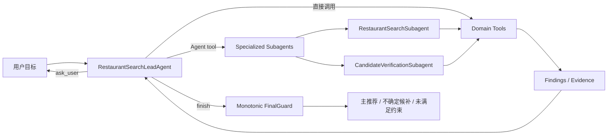

# Agent 开发最佳实践与架构根治决策（2026-08）

> 状态：生效中的架构决策。本文描述目标架构和迁移方法，不代表目标架构已经实现。
>
> 当前强制边界以
> [`../specs/restaurant-search-agent.md`](../specs/restaurant-search-agent.md) 为准；
> 产品目标和验收标准见
> [`../requirements/restaurant-search-agent.md`](../requirements/restaurant-search-agent.md)。

本文取代旧文档中“确定性 `policy.ts` 应成为唯一 planner”的目标结论。旧文档继续
记录已落地 workflow 的演进过程，但不再指导新增 Agent 行为。

## 1. 最终决策

目标架构采用 Anthropic 的 `orchestrator-worker pattern`：

- `RestaurantSearchLeadAgent` 持有完整上下文和全局语义决策权；
- Lead Agent 既可以直接调用 Domain tools，也可以通过统一 `Agent` tool 按需委派
  specialized subagents；
- Runtime 静态注册 subagent definitions，Lead Agent 动态创建和调用 subagent
  instances；
- subagent 在独立上下文中自主使用受限工具并返回压缩 findings/evidence；
- Lead Agent 综合结果并决定继续搜索、委派、补证、追问或结束；
- Runtime 执行和约束 Agent/tool loop，不替模型规划语义；
- 地点搜索只向 Agent 暴露自然语言 `search_places`，不暴露 Provider 分类目录；
- 候选验证严格区分 `supported/contradicted/unknown`，证据不足不能被下游提升；
- 以真实 tool trace、语义不变量、成本和失败恢复能力共同评测架构。

模型仍使用项目现有的 OpenAI-compatible endpoint。我们对齐 Claude Code 的 subagent
handler 行为，不引入 Claude Agent SDK Runtime，也不把模型供应商写进领域架构。

## 2. 旧系统是什么

当前 `runSearchAgentV3` 是代码主控的 multi-model workflow：

1. Runtime 在固定位置调用 GoalUnderstanding；
2. 固定调用 KeywordExpansion，并由代码安排它与首批搜索的并发；
3. `policy.ts` 通过有限状态和阈值决定搜索、追问、收敛；
4. 候选出现后，Runtime 固定批量调用 Evaluation；
5. 预设策略耗尽时，代码固定调用 Replan。

这些所谓“子 Agent”本质上都是一次强制 JSON function call。它们没有独立 tool loop，
也不是 Lead Agent 根据 description 动态选择的子 Agent。批量 Evaluation 即使并发，仍然
是代码调度的模型函数，而不是 orchestrator-workers。

按 Anthropic 对 workflow 与 agent 的区分，当前系统属于预定义代码路径中嵌入模型步骤
的 workflow。这个实现可以继续被维护，但不能以它的固定调用顺序定义目标 Agent。

### 2.1 历史命名漂移

旧项目语义把“调用一次模型完成某个角色任务”也命名成 Agent，因此出现了
`KeywordExpansionAgent`、`EvaluationAgent`、`PlanningAgent`、
`SupervisorPlannerAgent` 等名称，公共调用器也自然被命名为
`callJsonFunctionAgent`：

```text
一次性模型角色
  -> 被命名为 Agent
  -> 公共结构化调用器被命名为 callJsonFunctionAgent
```

这是一套历史角色命名，不是 Agent 资格证明。严格定义下，一次请求没有自主选择工具、
观察结果、循环执行和决定下一步的能力，只是 structured model call。真正的 Agent 是
Runtime 持续驱动的执行主体，其行为边界是：

```text
model turn -> tool call -> tool result -> next model turn -> finish/continue
```

迁移后的公共名称选择 `callStructuredModel`。没有选择 `generateStructuredOutput`，是因为
它容易同时指代 SDK 能力和上层生成任务；没有选择 `callJsonFunctionModel`，是因为 JSON
function 是当前传输协议细节，而不是这项能力的长期语义。迁移时同步采用以下边界：

- `callJsonFunctionAgent` -> `callStructuredModel`；
- 仍保留的一次性角色使用 `<Purpose>Model`，如果改造成自主 child loop 才命名为
  `<Purpose>Subagent`；
- `agentName` 指标维度改为 `modelRole` 或 `operationName`；
- `callStructuredModel` 可以作为 Runtime 的单次结构化请求能力，但不拥有 loop；
- Agent Runtime 使用能够返回 assistant message/tool calls 的单轮模型传输能力，重复推进
  loop 并执行工具，不能通过重命名单次调用器来冒充 Agent。

## 3. 根因分类

反复出现的长尾失败不是缺少某个词条，而是六类系统问题叠加：

1. **Workflow / Agent 形态错配**：产品期待动态推理，实现却由有限状态决定动作。
2. **开放世界 / 闭集规则错配**：自然语言餐饮需求无限扩展，本地 taxonomy 只能覆盖
   已知词表。
3. **语义权威倒置**：模型或用户提供的 query 被 Runtime、taxonomy 或 Adapter 静默
   改写。
4. **上下文碎片化**：多个一次性模型函数各看局部输入，没有一个模型对决策链负责。
5. **Grounding 缺口**：POI 召回和分类事实被误当成菜品供应证据。
6. **评测目标错配**：固定 case、调用次数和结果数量代替了工具、关系、授权和证据评测。

为“柠檬茶”“寿司”“羊肉火锅”等样例追加词条，只会把当前样例移进闭集；下一批复合
菜品、地域叫法、品牌词、否定表达和过敏约束仍然落出词表。一个词条还可能同时影响
query 归一、POI type、搜索扩展、验证和准入，局部修复会持续制造交叉回归。

## 4. 为什么保留 orchestrator-workers

把语义控制权从 policy 移给 Lead Agent，不等于退化成单 Agent。最终形态仍然是：



Lead Agent 直接处理简单任务，是为了避免无意义的上下文复制和额外模型调用；它并不
取消 subagent。只有具备独立探索方向、适合并行、需要不同工具/instructions/model，
或需要隔离大量候选验证上下文时才委派。

Anthropic 的生产多 Agent Research 系统同样由 lead agent 制定策略、创建 specialized
subagents、综合结果并决定是否继续委派。Anthropic 也指出，多 Agent 适合 breadth-first
并行探索，但 token 成本显著增加，不适合强依赖同一上下文或存在大量前后依赖的任务。

因此是否委派不是代码固定开关，而是 Lead Agent 的语义决定；是否值得保留某类委派，
则由 Lead-only 与 Lead + subagents 的对拍 eval 决定。

## 5. OpenAI-compatible 模型与 Claude Code 风格 Handler

### 5.1 选择

保留当前 OpenAI-compatible 模型端口，实现自有 Agent Runtime。目标不是复制 Claude
Code 内部代码，而是对齐其公开的 subagent 行为契约：

- 一个模型可见的统一 `Agent` tool；
- 通过 subagent description 选择类型；
- 每次调用创建独立 child context；
- child agent 自主运行 model-tool loop；
- tool allowlist、`maxTurns`、预算、并发和递归深度限制；
- 返回结构化最终结果和 child run id；
- child trace 独立保存，Lead 上下文只接收压缩结果。

不直接使用 Claude Agent SDK 的原因是其托管模型依赖 `claude` CLI 子进程和适合容器/
sandbox 的运行环境；本项目主运行面是 Cloudflare Worker。自有 Handler 可以保留现有
部署形态和模型供应商，同时采用 Anthropic 已验证的交互模式。

### 5.2 静态 definition，动态 instance

文档不再使用含混的“动态创建或调用 Agent”表述。准确契约是：

```ts
interface SubagentDefinition {
  name: string;
  description: string;
  instructions: string;
  tools: string[];
  model?: string;
  maxTurns: number;
  outputSchema: unknown;
}
```

Runtime 静态注册 definitions。Lead Agent 调用：

```ts
Agent({
  subagentType: 'restaurant-search',
  task: taskSnapshot,
  mode: 'foreground'
});
```

`AgentToolHandler` 校验 definition 和预算、创建 child run、执行 tool loop、持久化 trace，
最后返回 `{ agentId, status, result }`。Lead Agent 决定调用时机，Handler 不做语义规划。

### 5.3 模型客户端前置条件

当前 `callJsonFunctionAgent` 是一次强制 function call；它应先按第 2.1 节迁移为
`callStructuredModel`，继续服务确实只需一次结构化输出的模型角色。Agent Runtime 另行
引入可返回完整 assistant message/tool calls 的单轮模型传输能力，并在其上实现
`assistant -> tool_call -> tool_result -> assistant` 循环。两者不能合并成同一个含混的
“Agent 调用器”。

针对实际 OpenAI-compatible endpoint 需要验证：

- 多工具选择和参数遵循；
- tool result 回填；
- 连续多轮 tool call；
- 结构化最终输出；
- 截断、重试和 thinking 配置兼容性。

未通过 capability eval 时不能只靠“接口兼容 OpenAI”假设模型具备可靠 Agent 能力。

## 6. Subagent 上下文选择

第一版采用完整、不可变、自包含的 task snapshot，而不是 `goalSliceIds`、
`knownEvidenceRefs` 或依赖共享状态的 read tools：

```ts
interface SubagentTaskSnapshot {
  taskId: string;
  objective: string;
  goalSnapshot: UserGoal;
  authorizationSnapshot: AuthorizationSnapshot;
  location: Location;
  attemptSummary: SearchAttemptSummary[];
  candidateFacts?: RestaurantCandidateFact[];
  excludedScope: string[];
  successCriteria: string[];
  outputSchemaVersion: string;
  budget: SubagentBudget;
}
```

餐厅搜索 task 和候选批次足够小，自包含快照更容易重试、回放、审计和隔离并发修改。
只有实际 trace 证明 payload 超出上下文预算后，才引入只读 artifact store。那时仍需在
task brief 中保留完整目标、授权和成功标准，不能只传不透明 id。

## 7. Runtime 与 Policy 的归属

Runtime 继续存在。`Policy` 不再是目标架构中的独立 planner，也不整体并入一个巨型
`runtime.ts`：

| 原职责 | 目标归属 |
|---|---|
| 搜什么、是否 broaden、何时补证/追问/结束 | `RestaurantSearchLeadAgent` |
| schema、硬事实和安全校验 | Runtime guard |
| token、轮次、工具、成本上限 | Runtime limits |
| 并发、队列、重试和背压 | Runtime scheduler |
| 用户授权验证 | Runtime authorization |
| session、parent-child tree、checkpoint/resume/cancel | Runtime lifecycle |
| trace、指标和错误归因 | Runtime observability |

Runtime 可以拒绝动作，但不能自动生成语义不同的替代 action。它必须支持 child run
幂等、部分失败、超时取消、恢复后避免重复外部调用，以及 Lead/child 的因果 trace。

## 8. 地点搜索工具：只暴露自然语言

### 8.1 取消分类工具和搜索 CategoryRegistry

以下目标设计全部取消：

```text
lookup_place_categories
list_place_categories
CategoryRegistry for search
categoryRef
natural-language -> POI typecode
寿司 -> 日本料理
柠檬茶 -> 冷饮店
```

Anthropic 建议为 Agent 提供少量、面向高价值工作流的工具，而不是逐个包装底层 API；
让 Agent 读取完整列表再选择会浪费上下文。其工具研究还显示，自然语言名称通常比
UUID、code 等低层标识更容易被 Agent 正确使用。

主流 Places API 也以自然语言作为主检索条件：Google Places Text Search 接受
`textQuery`，`includedType` 是可选偏置/过滤；Amazon Location SearchText 接受自由文本
`QueryText` 并把 categories 作为地点事实返回；高德接受单个 `keywords`，`types` 用于
可选类型限定。

因此 Agent 只看到：

```ts
interface SearchPlacesInput {
  query: string;
  location: Location;
  radiusMeters: number;
  relation: 'exact' | 'equivalent' | 'broader' | 'alternative';
  filters?: {
    openNow?: boolean;
    maxAveragePrice?: number;
  };
}
```

### 8.2 Provider Adapter 的正确职责

Domain tool contract 尽量 provider-neutral；Provider Adapter 本身必须 provider-specific。
二者不矛盾：

```text
RestaurantSearchLeadAgent
  -> search_places({ query: "寿司", relation: "exact", ... })
SearchPlacesToolHandler
  -> Provider 调度、预算、分页、并发
AmapSearchAdapter
  -> keywords=寿司, types=050000
高德 POI Search
```

`050000` 不是从“寿司”推导出来的，而是产品固定的 Amap 餐饮场所范围：它排除学校、
医院、银行等非餐饮 POI，不表达任何菜品或菜系结论。

Adapter 只处理 Provider wire format、认证、分页、超时和无损字段规整。它不做自然语言
理解、同义词展开、broaden、目标关系或候选资格判断。

### 8.3 分类码表只做返回事实解释

高德分类码表可以保留，但仅用于：

```text
高德返回 typecode=050202
  -> describeAmapTypeCode("050202")
  -> “该 POI 被高德归类为日本料理”
```

分类目录不注册为 Agent tool，不进入搜索 request planning，也不把“日本料理”升级为
“提供寿司”。它可以用于 trace、展示和候选事实解释。

### 8.4 无结果后的 broaden

如果 `query=寿司` 没有足够结果，Lead Agent 可以在用户授权后产生新的自然语言 action：

```ts
search_places({
  query: '日本料理',
  location,
  radiusMeters: 3000,
  relation: 'broader'
});
```

这次“寿司 -> 日本料理”是显式、可观察、可评测的 Agent 策略。它必须记录原目标、
新 query、relation、rationale 和授权；不能藏在 Adapter、taxonomy 或 Runtime 中。

## 9. POI 召回不是菜品证据

这是开放世界 grounding 和数据覆盖问题，不是增加 Agent 数量可以解决的问题。

公开 Places 数据通常提供地点类型、评论、网站和粗粒度属性，不提供任意、实时菜品
清单。可靠菜单往往是独立数据资源：Google Business Profile 的 `FoodMenus` 属于商家
账号范围并要求管理授权；Schema.org 也把 `hasMenu -> Menu -> MenuItem` 建模为独立
菜单事实。

系统必须拆开三层：

1. `query` 用于召回，保持用户或 Agent 的自然语言；
2. Provider category 是候选事实或产品范围，不证明菜品；
3. evidence 才决定目标是否 `supported/contradicted/unknown`。

“用寿司搜索命中一家被高德归类为日本料理的店”只能说明它是相关候选。除非店名、
菜单、商家页面或其他可追溯事实明确支持寿司，否则菜品结论仍为 `unknown`。不确定候选
可以单独展示，但不能为了凑满转盘进入主推荐。

多 Agent 能帮助并行查找证据，但不能把数据源没有提供的事实推理成真。若未来接入菜单
源，应把它实现为高层 `inspect_place`/evidence capability，并记录来源、获取时间和
claim；不要再造菜品 taxonomy。

## 10. Goal、Relation 与授权

UserGoal 是不可变语义源，保留用户原始表达和结构化约束。任何派生 query 都通过新
action 表达，不得覆盖目标。

```ts
interface SearchAction {
  id: string;
  query: string;
  supportsGoalIds: string[];
  relation: 'exact' | 'equivalent' | 'broader' | 'alternative';
  rationale: string;
  authorizationRef?: string;
}
```

`allowedForPrimary` 从 Agent 输出中删除。它同时重复表达 `relation` 和授权状态，允许产生
`relation='broader'`、授权无效但布尔值为 `true` 的矛盾状态，也容易被误解为候选已经
满足全部主推荐条件。

Runtime 接受 action 时分配稳定 `id`，并只根据 relation 与授权记录派生范围资格：

```ts
const primaryScopeAuthorized =
  action.relation === 'exact'
  || action.relation === 'equivalent'
  || authorizationCovers(action.authorizationRef, action);
```

`authorizationCovers` 必须绑定当前 goal/version、relation 和 action scope，并在引用缺失、
失效或范围不匹配时 fail closed。`primaryScopeAuthorized` 可以持久化到 Runtime 的执行或
admission record，但不能回写为 Agent 可控制的 action 字段。

`broader/alternative` 结果只有在用户预先授权或一次显式追问后，才可以获得相应范围的
推荐资格。Runtime 不自行推断 relation，也不在搜索失败后自动放宽。范围获授权只是主
推荐的必要条件；候选仍需通过 evidence verification、硬约束和 FinalGuard。

## 11. 评测策略

### 11.1 两类评测分离

- Runtime/workflow 回归：预算、并发、重试、事件、缓存、去重、持久化、恢复和取消。
- Agent 质量：工具选择、自然语言 query、relation、授权、证据、委派、综合和停止原因。

现有模型桩 + fixture eval 只能承担第一类，不能证明真实模型的 Agent 质量。

### 11.2 Multi-agent fit gate

同一任务集分别运行 Lead-only 和 Lead + subagents，比较：

- 目标保真和最终正确率；
- evidence coverage 与 unsupported claim rate；
- tool/subagent 选择质量；
- token、延迟、外部调用和失败率；
- checkpoint/resume 后的一致性。

只有独立探索带来的质量收益超过成本和失败面时，才保留对应 subagent。简单 query 不应
为了符合架构图而强制委派。

### 11.3 不变量和对抗样例

评测至少覆盖：

- 同义改写后目标和授权不变；
- 追加修饰词后 query 不得静默丢词；
- 追加排除项后结果只能收窄；
- 未授权 broaden 不能进入主推荐；
- 删除菜单证据后，菜品资格必须降为 `unknown`；
- 相同 Provider 事实改变顺序时，结论不翻转；
- Agent 不调用分类列表工具，也不生成/选择 typecode；
- simple query 允许 Lead 直达工具，复杂 breadth-first query 能正确委派；
- child timeout、失败或恢复不会导致重复搜索和错误综合。

具体菜名是通用不变量的样本。新增 eval 样本时，生产代码不应同步增加词条。

## 12. 迁移顺序

1. 冻结新的业务语义特判和搜索向 CategoryRegistry 扩展。
2. 补齐真实模型 capability eval、Agent trace 和 Lead-only 基线。
3. 将历史单次调用器迁移为 `callStructuredModel`，并把一次性角色和指标中的 Agent
   命名改为 Model/`modelRole`；这一步只纠正抽象名称，不宣称已实现 Agent。
4. 实现 OpenAI-compatible model-tool loop 和统一 `AgentToolHandler`。
5. 注册少量清晰的 subagent definitions，并使用完整 task snapshot。
6. 让 Lead Agent 先以 shadow/对拍方式直接调用 `search_places`，后续按 eval 开启委派。
7. 将 semantic planning 从 `policy.ts` 迁入 Lead Agent，把硬机制拆入 Runtime 模块。
8. 删除生产路径中的 taxonomy 搜索改写、分类选择和 `unverified` 主推荐补位。
9. 加入 parent-child lifecycle、checkpoint/resume/cancel 和故障注入测试后再切主路径。

迁移期间每个 PR 都必须说明：它是在维护当前 workflow，还是在推进目标 Agent。不能用
两套相反的职责边界解释同一段代码。

## 13. 设计依据

- Anthropic, [How we built our multi-agent research system](https://www.anthropic.com/engineering/built-multi-agent-research-system)：
  orchestrator-worker、lead agent、specialized subagents、动态委派、并行探索、综合循环
  以及多 Agent 的适用范围和成本。
- Anthropic, [Subagents in the Claude Agent SDK](https://platform.claude.com/docs/en/agent-sdk/subagents)：
  main agent、统一 `Agent` tool、description-based selection、独立上下文、工具限制、
  `maxTurns`、并发和成本上限。
- Anthropic, [Building effective agents](https://www.anthropic.com/research/building-effective-agents)：
  workflow 与 agent 的边界、orchestrator-workers 模式、工具设计和评测原则。
- Anthropic, [Writing effective tools for AI agents](https://www.anthropic.com/engineering/writing-tools-for-agents)：
  少量高层工作流工具、避免 list-all 工具、减少低层技术标识和基于 eval 优化工具。
- Anthropic, [Hosting the Claude Agent SDK](https://platform.claude.com/docs/en/agent-sdk/hosting)：
  Claude CLI 子进程、容器/sandbox 和 session 文件等托管要求。
- Google, [Places Text Search](https://developers.google.com/maps/documentation/places/web-service/text-search)：
  自然语言 `textQuery` 是主查询，`includedType` 是可选过滤/偏置。
- Amazon, [Location SearchText](https://docs.aws.amazon.com/location/latest/APIReference/API_geoplaces_SearchText.html)：
  自由文本 `QueryText` 搜索以及结果中的 categories。
- 高德开放平台, [搜索 POI 2.0](https://lbs.amap.com/api/webservice/guide/api-advanced/newpoisearch)：
  单个 `keywords`、可选 `types` 和 Provider 综合排序。
- Google, [Business Profile Food Menus](https://developers.google.com/my-business/reference/rest/v4/accounts.locations/getFoodMenus)：
  菜单作为独立、需管理授权的地点资源。
- Schema.org, [Menu](https://schema.org/Menu)：菜单、菜单分区和菜单项的独立结构化事实。
